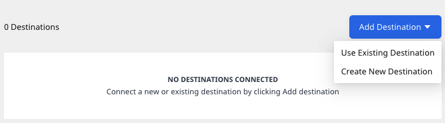

# Amazon S3

[Amazon S3](https://aws.amazon.com/s3/)\(Simple Storage Service\) is a cloud-based object storage service that lets businesses securely store their data at scale.

RudderStack supports S3 as a source from which you can ingest data and route it to your desired downstream destinations.

## Setting up the S3 source in RudderStack

To set up Amazon S3 as a source in RudderStack, follow these steps:

### Naming the source

1. Log into your [RudderStack dashboard](https://app.rudderstack.com).
2. From the left panel, select go to **Source** > **New Source** > **Reverse ETL**. Then, select **S3**, as shown:


3. Assign a name to your source.

### Configuring the connection credentials

1. Enter the relevant settings in the **Connection Credentials** sections as shown below:
   - **Account Name** - Enter the name you wish to assign to this connection account.
   - **AWS Access Key ID** - Enter your AWS access key ID.
   - **AWS Secret Access Key** - Enter your AWS secret access key.

<div class="infoBlock">

To get the <strong>AWS Access Key ID</strong> and the <strong>AWS Secret Access Key</strong>, sign into your AWS Management Console as <a href="https://docs.aws.amazon.com/IAM/latest/UserGuide/console.html#root-user-sign-in-page">the root user</a>. Then, in the navigation bar on the upper right corner, choose your account name and select <strong>My Security Credentials</strong>.

For more information on getting these AWS credentials, refer to the <a href="https://docs.aws.amazon.com/general/latest/gr/aws-sec-cred-types.html">AWS documentation</a>.
</div>

<div class="successBlock">

  If you've already configured S3 as a source before, your existing credentials will automatically appear under <strong>Use Existing Credentials</strong>.
</div>

- The minimum S3 actions that need to be attached to the above access keys are listed below:

```text
"Action": [
                "s3:GetObject",
                "s3:ListBucket"
            ],
```

### Schedule settings

1. Specify the **Schedule Settings** to schedule the data syncs from your S3 source.

<div class="infoBlock">

RudderStack lets you schedule data syncs for your Reverse ETL sources and specify how and when the syncs will run. For more information on the <strong>Basic</strong>, <strong>CRON</strong>, and <strong>Manual</strong> schedule types, refer to the <a href="https://www.rudderstack.com/docs/warehouse-actions/common-settings/sync-schedule-settings/">Sync Schedule Settings</a> guide.
</div>

2. After specifying the schedule type and run settings, click on **Continue** to finish the setup.

S3 is now successfully configured as a source in your RudderStack dashboard. You can further connect this source to your preferred destination by clicking on **Add Destination** button, as shown:



<div class="infoBlock">

If you have already configured a destination in RudderStack, choose the <strong>Use Existing Destination</strong> option which will take you to the <strong>Schema</strong> tab in the source settings. To add a new destination from scratch, select the <strong>Create New Destination</strong> option which will take you to the destination configuration page.
</div>

## Specifying the data to import

This section lists the bucket configuration settings needed for RudderStack to import the data and sync it to the connected destination. 

- **S3 Bucket Name**:  Enter the name of the S3 bucket.
- **Prefix**:  Prefix refers to the path within your S3 bucket from where RudderStack will import the data. For example, if **Prefix** is set to `RUDDER`, then RudderStack will import the data stored in the location `<your_s3_bucket>/RUDDER`.


<div class="warningBlock">

Your S3 bucket(with the prefix, if specified above) should consist of Apache Parquet files only. Currently, Rudderstack can extract only Parquet files.
</div>

- **Choose user identifier**: Choose atleast one user identifier from `user_id` and `anonymous_id` from the dropdown.
- Once you specify the above settings, you will be able to preview a snippet of your data, as shown below:


- Here, you can select all or only specific columns of your choice, search the columns by a keyword, and also edit the **JSON Trait Key**. You can also preview the resulting JSON on the right.
- **Add Constant**: You can use this option to add a constant key-value pair which is always sent in the JSON payload, as shown:


<div class="infoBlock">

For more information on this option, refer to the <a href="https://rudderstack.com/docs/warehouse-actions/common-settings/importing-data-using-tables#add-constant">Add Constant</a> section.
</div>

<div class="infoBlock">

As an alternative to JSON mapping, you can map the columns using the <a href="https://www.rudderstack.com/docs/warehouse-actions/features/visual-data-mapper/">Visual Data Mapper</a> feature. However, note that this feature is currently supported only for selective destinations.
</div>

## Updating an existing configuration

To update an existing configuration, follow these steps:

1. Go to the **Schema** tab of your configured source.
2. Click on the **Update** button on the top right.
3. Then, update your column selection.

<div class="warningBlock">

When updating the configuration, you can only change the existing mappings. The <strong>S3 Bucket Name</strong>, <strong>Prefix</strong>, and <strong>User Identifier</strong> fields are not editable.
</div>

4. Finally, click on the **Save** button.

<div class="infoBlock">

After updating the configuration, the next sync will be a full sync.
</div>

## FAQs

### Where can I obtain the AWS Access Key ID and the AWS Secret Access Key?

To get the **AWS Access Key ID** and the **Secret Access Key**, follow these steps:

1. Sign into your AWS Management Console as the [root user](https://docs.aws.amazon.com/IAM/latest/UserGuide/console.html#root-user-sign-in-page).
2. Then, in the navigation bar on the upper right corner, choose your account name and select **My Security Credentials**.

<div class="infoBlock">

For more information on getting these AWS credentials, refer to the <a href="https://docs.aws.amazon.com/general/latest/gr/aws-sec-cred-types.html">AWS documentation</a>.
</div>

## Contact us

For queries on any of the sections covered in this guide, you can [contact us](mailto:%20docs@rudderstack.com) or start a conversation in our [Slack](https://rudderstack.com/join-rudderstack-slack-community) community.
