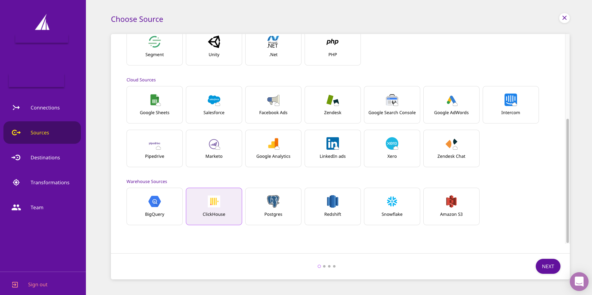
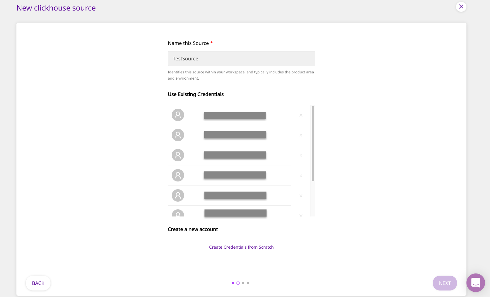

# ClickHouse

[ClickHouse](https://clickhouse.tech/) is an open-source, column-oriented database management system mainly used for online analytical processing \(OLAP\). It is fast, and allows for real-time analysis of your data. ClickHouse was originally developed by Yandex, the Russian IT company,  for the Yandex Metrica web analytics service. ClickHouse is highly scalable, and built for high performance.

This guide will help you configure ClickHouse as a source from which you can route event data to your desired destinations through RudderStack.

## Getting Started

To set up ClickHouse as a source in RudderStack, follow these steps:

* Log into your [RudderStack dashboard](https://app.rudderlabs.com/signup?type=freetrial).
* From the left panel, select **Sources**. Then, click on **Add Source**, as shown:

* Scroll down to the **Warehouse Sources** and select **ClickHouse**. Then, click on **Next**.

### Setting Up the Connection

* Assign a name to your source, and click on **Create Credentials from Scratch**. Then, click on **Next**.


If you've already configured ClickHouse as a source before, your existing credentials will automatically appear under **Use Existing Credentials**.


* Next, enter the relevant connection details in the **Connection Credentials** as shown below:

* The required settings are:
  * **Host -** The host name of your ClickHouse service.
  * **Database -** The database name in your ClickHouse instance where the data is loaded.
  * **User** - The username which has the required read/write access to the above database.
  * **Password** - The password for the above user should be specified here.
  * **Port** - The port number of your ClickHouse service should be specified here.

### Specifying the Data to Import

* Next, select the **Schema** and the **Table** from which you want RudderStack to import the data.


Your table must include one of the following columns - `email`, `user_id`, or `anonymous_id`.


* Once you specify the table containing the required columns, you will be able to preview a snippet of your data, as shown below:

* Here, you can select all or only a few specific columns of your choice, search the columns by a keyword, and also edit the **JSON Trait Key**, as shown below. You can also preview the resultant JSON on the right. Once you've select the required table columns to import the data from, click on **Next**.

### Setting the Data Update Schedule

* Next, you will be required to set the **Run Frequency** to schedule the data import from your ClickHouse instance to RudderStack. You can also specify the time when you want this synchronization to start, by choosing the time under the **Sync Starting At** option. Then, click on **Next**.

That's it! ClickHouse is now successfully configured as a source on your RudderStack dashboard. 

RudderStack will start importing data from your ClickHouse instance as per the specified frequency. You can further connect this source to your preferred destination by clicking on **Connect Destinations** or **Add Destinations**, as shown:


If you have already configured a destination on the RudderStack platform, choose the **Connect Destinations** option. To add a new destination from scratch, you can select the **Add Destination** option.


## Contact Us

If you come across any issues while configuring ClickHouse as a source on the RudderStack dashboard, please feel free to [contact us](mailto:%20docs@rudderstack.com). You can also start a conversation on our [Slack](https://resources.rudderstack.com/join-rudderstack-slack) channel; we will be happy to talk to you!

