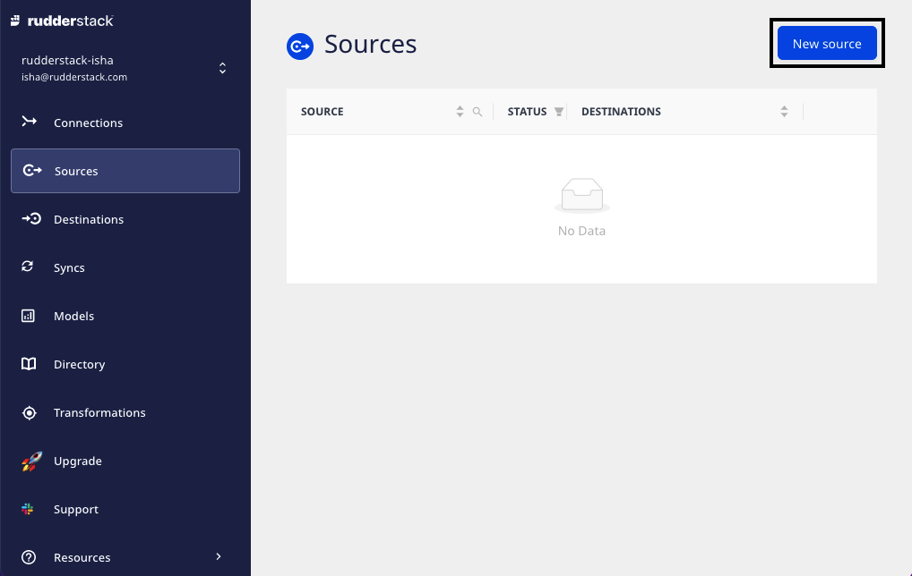
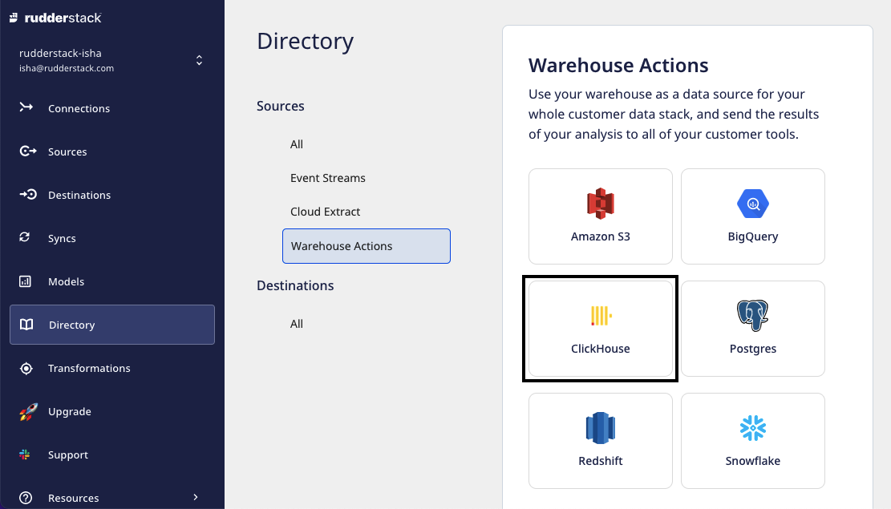
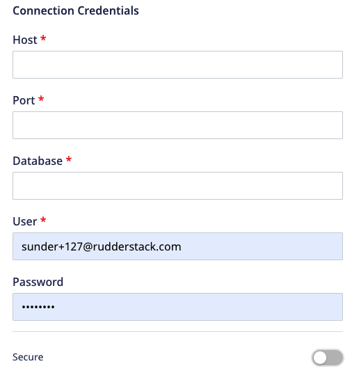
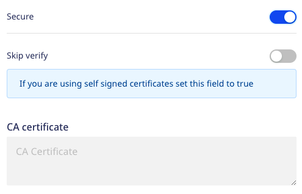
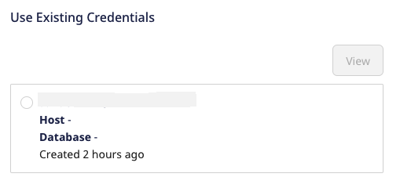
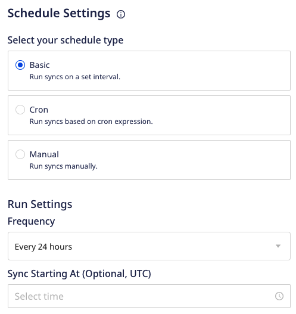
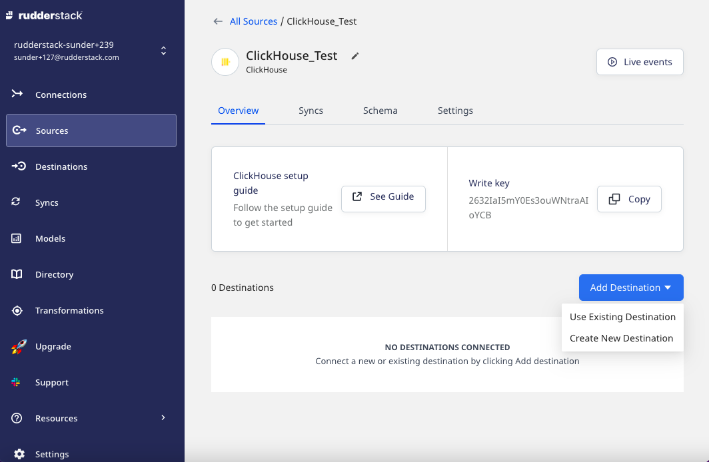

# ClickHouse

[ClickHouse](https://clickhouse.tech/) is an open-source, column-oriented database management system mainly used for online analytical processing \(OLAP\). It allows generating analytical reports using SQL queries that are updated in real-time. ClickHouse is highly scalable, fast, and built for high performance.

RudderStack supports ClickHouse as a source from which you can ingest enriched user information and route it to your desired downstream destinations.

## Setting up ClickHouse as source

The below section explains the detailed steps to set up ClickHouse as a source in RudderStack.

### Step 1: Naming the source

1. Log into your [RudderStack dashboard](https://app.rudderlabs.com/signup?type=freetrial).

2. Select **Sources** from the left panel. Then, click on **New source**, as shown:

3. Click on the **Warehouse Actions** and select **ClickHouse**.

4. Assign a name to the source and click on **Continue**.

### Step 2: Configuring the source credentials

1. Click on **Create Credentials from Scratch** and enter the relevant details in the **Connection Credentials**:

- **Host** - Host name of your ClickHouse service.
- **Port** - Port number of your ClickHouse service.
- **Database -** Database name in your ClickHouse instance where the data is loaded.
- **User** - Username which has the required read/write access to the above database.
- **Password** - Password for the above user.
- **Secure** - Enabling this setting establishes a secure connection and displays the additional settings:

  - **Skip Verify** - Skips certificate verification. If you are using self-signed certificates, set this field to `true`.
  - **CA certificate** -  Certificate contents of the certificate which needs to be verified while establishing a secure connection.

  If you've configured ClickHouse as a source before, you can select the existing
  credentials from <strong>Use existing credentials</strong>, as shown:

2. Click on **Continue** to verify your credentials. For more information, refer to [FAQ section](https://www.rudderstack.com/docs/warehouse-actions/clickhouse/#faq). Once verified, click on **Continue** again.

### Step 3: Setting the data update schedule

1. Specify the **Schedule Settings** to schedule the data import from your ClickHouse instance to RudderStack. 

For more information on these settings, refer to <a href = "https://www.rudderstack.com/docs/warehouse-actions/common-settings/sync-schedule-settings/">Sync Schedule Settings</a>.

2. Click on **Continue** to configure the source successfully.

 You can further connect the source to your preferred destination by clicking on <strong>Add Destination</strong>, as shown:

## FAQ

### What do the three validations under Verifying Credentials imply?

When setting up a Warehouse Actions source, once you proceed after entering the connection credentials, you will see the following three validations under the **Verifying Credentials** option:

These options are explained below:

* **Verifying Connection**: This option indicates that RudderStack is trying to connect to the warehouse with the information specified in the connection credentials. 

If this option gives an error, it means that one or more fields specified in the connection credentials are incorrect. Verify your credentials in this case.

* **Able to List Schema**: This option checks if RudderStack is able to fetch all the schema details using the provided credentials. 
* **Able to Access RudderStack Schema**: This option implies that RudderStack is able to access the `_RUDDERSTACK` schema you have created by successfully running all the commands in the [**User Permissions**](https://rudderstack.com/docs/warehouse-actions/snowflake#granting-permissions) section. 

If this option gives an error, verify if you have successfully created the <code class="inline-code">_RUDDERSTACK</code> schema and given RudderStack the required permissions to access it. For more information, refer to [this section](https://rudderstack.com/docs/warehouse-actions/snowflake#creating-the-rudderstack-schema-and-granting-permissions).

If you are trying to reuse the credentials for Warehouse Actions sources from before September 2021, you may run into the following permissions error:

As mentioned above, you will need to update your Snowflake account permissions by following the commands in [this section](https://rudderstack.com/docs/warehouse-actions/snowflake#creating-the-rudderstack-schema-and-granting-permissions).

## Contact Us

For queries on any of the sections covered in this guide, you can [contact us](mailto:%20docs@rudderstack.com) or start a conversation in our [Slack](https://rudderstack.com/join-rudderstack-slack-community) community.
