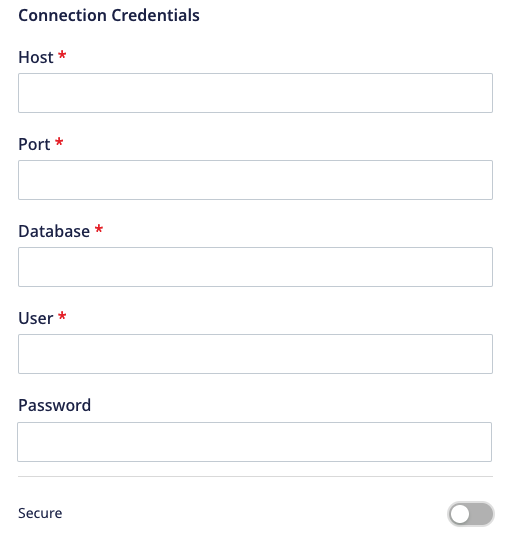
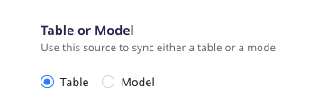

# ClickHouse

[ClickHouse](https://clickhouse.tech/) is an open-source, column-oriented database management system mainly used for online analytical processing \(OLAP\). It lets you generate analytical reports that are updated in real-time using SQL queries. ClickHouse is highly scalable, fast, and built for high performance.

RudderStack supports ClickHouse as a source from which you can ingest data and route it to your desired downstream destinations.

## Setting up ClickHouse as source in RudderStack

To set up ClickHouse as a source in RudderStack, follow these steps:

### Naming the source

1. Log into your [RudderStack dashboard](https://app.rudderlabs.com/signup?type=freetrial).

2. From the left navigation bar, go to **Source** > **New Source** > **Warehouse Actions**.  Then, select **ClickHouse**, as shown:

3. Assign a name to your source.

### Configuring the connection credentials

1. Enter the relevant settings in the **Connection Credentials** section as listed below:

- **Host** - Host name of your ClickHouse service.
- **Port** - Port number of your ClickHouse service.
- **Database -** Database name in your ClickHouse instance where the data is loaded.
- **User** - Username which has the required read/write access to the above database.
- **Password** - Password for the above user.
- **Secure** - Enabling this setting establishes a secure connection and displays additional settings as mentioned below:

  - **Skip Verify** - Skips certificate verification. Set this field to `true` if you are using self-signed certificates.
  - **CA certificate** -  Certificate contents of the certificate which needs to be verified while establishing a secure connection.

If you've configured ClickHouse as a source before, you can select the existing credentials from <strong>Use existing credentials</strong> option.

2. Click on **Continue** to verify your credentials. RudderStack will then verify and validate your credentials. 

For more information on these validation steps, refer to the <a href="#faq">FAQ</a> section. 

3. Once verified, click on **Continue** to proceed.

### Schedule settings

1. Specify the **Schedule Settings** to schedule the data syncs from your ClickHouse instance.

RudderStack lets you schedule data syncs for your Warehouse Actions sources and specify how and when the syncs will run.
For more information on the <strong>Basic</strong>, <strong>CRON</strong>, and <strong>Manual</strong> schedule types, refer to the <a href="https://www.rudderstack.com/docs/warehouse-actions/common-settings/sync-schedule-settings/">Sync Schedule Settings</a> guide.

2. After specifying the schedule type and run settings, click on **Continue** to finish the setup.

ClickHouse is now successfully configured as a source in your RudderStack dashboard. You can further connect this source to your preferred destination by clicking on **Add Destinations** button, as shown:

If you have already configured a destination in RudderStack, choose the <strong>Use Existing Destination</strong> option which will take you to the `Schema` tab within the source settings. To add a new destination from scratch, select the <strong>Create New Destination</strong> option which will take you to the configuration settings of the destination.

## Specifying the data to import

While connecting a destination to your Warehouse Actions source, you can use the default JSON mapping or the [Visual Data Mapping](https://www.rudderstack.com/docs/warehouse-actions/features/visual-data-mapper/) feature to map the warehouse columns to your destination fields.

Based on the option (Table/Model) you chose while setting up the Warehouse Actions source, follow the relevant guide for detailed steps:

<ul>
<li><a href="https://www.rudderstack.com/docs/warehouse-actions/common-settings/importing-data-using-tables/">Importing Data using Tables</a></li>
<li><a href="https://www.rudderstack.com/docs/warehouse-actions/common-settings/importing-data-using-models/">Importing Data using Models</a></li>
</ul>

## FAQ

### What is the difference between the Table and Model options when creating a Warehouse Actions source?

When creating a new Warehouse Actions source, you are presented with the following two options from which RudderStack will sync the data:

- When you choose **Table**, RudderStack imports all the data associated with the specified table during the sync.
- When you choose **Model**, RudderStack imports the data by running the query specified in the connected model, during the sync.

## Contact Us

For queries on any of the sections covered in this guide, you can [contact us](mailto:%20docs@rudderstack.com) or start a conversation in our [Slack](https://rudderstack.com/join-rudderstack-slack-community) community.
