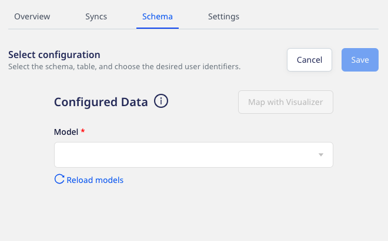
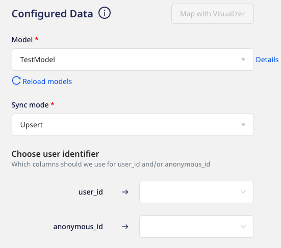

# Importing Data using Models

RudderStack's **Models** feature lets you define and run custom SQL queries on your warehouse data and send the results to your specified destinations.

You can create a model in the RudderStack dashboard and use it while connecting a Warehouse Actions source to a destination. For detailed steps on how to create a model, refer to the <a href="https://www.rudderstack.com/docs/warehouse-actions/features/models/">Models</a> guide.

You can select either of the below-mentioned options while adding a destination to your Warehouse Actions source:

* **Use Existing Destination** - Redirects you to the `Schema` tab within the source settings where you can configure a model
* **Create New Destination** - Redirects you to the configuration settings of the destination before configuring a model

Next, follow these steps to configure a model:

1. Select the required model from the dropdown list.

  
The dropdown will only display the list of models corresponding to the Warehouse Actions source you have configured. For example, only the BigQuery models will be listed in the dropdown for a BigQuery warehouse source.

2. Select the [**Sync mode**](https://www.rudderstack.com/docs/warehouse-actions/common-settings/sync-modes/) and at least one user identifier (**user_id/anonymous_id**) from the dropdown list.

You can also preview the data snippet which RudderStack will send to the destination. All the resulting columns from running the model's query are selected by default. However, you can choose to retain specific columns by searching and selecting them. You can then preview the resulting JSON on the right, as shown:

  
  Alternatively, you can map the columns using the <a href="https://www.rudderstack.com/docs/warehouse-actions/features/visual-data-mapper/">Visual Data Mapper</a> feature. For more information, refer to <a href="https://www.rudderstack.com/docs/warehouse-actions/features/visual-data-mapper/#choosing-the-identifier">Choosing the identifier</a> section.
  

  
The JSON payload carries the <code class="inline-code">user_id</code> and <code class="inline-code">anonymous_id</code> from the columns selected in the <strong>Choose user identifier</strong> section. Moreover, the traits are used from the columns selected in the <strong>Column</strong> section.

## Add Constant

You can also use the **Add Constant** option that lets you add a constant key-value pair which is always sent in the JSON payload, as shown:

Once you have finalized the configuration, click on **Save**.

## Updating the columns selection  

You can update the selection of columns from which RudderStack sends data to the specified destinations by following these steps:

1. Click on the source and select the **Schema** tab.
2. Then, click on the **Update** button, as shown:

3. Update your column selection and click on the **Save** button.

## FAQ

### What is the difference between the Table and Model options when creating a Warehouse Actions source?

When creating a new Warehouse Actions source, you are presented with the following two options from which RudderStack will sync the data:

- When you choose **Table**, RudderStack imports all the data associated with the specified table during the sync.
- When you choose **Model**, RudderStack imports the data by running the query specified in the connected model, during the sync.

## Contact us

For more information on models, you can [**contact us**](mailto:%20docs@rudderstack.com) or start a conversation in our [**Slack**](https://rudderstack.com/join-rudderstack-slack-community) community.
