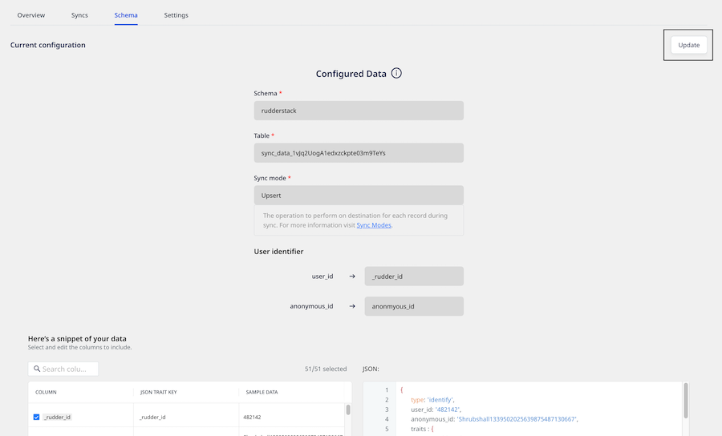

# Importing Data using Tables

This guide lists the settings required to import and sync data from your warehouse table to the specified destination.

This guide is applicable for Warehouse Actions sources configured using the <strong>Table</strong> option. For more information on the data import settings for models, refer to the <a href="https://www.rudderstack.com/docs/warehouse-actions/features/setting-up-connections-using-models/">Importing Data using Models</a> guide.

## Data import settings

The settings to import and sync data from your warehouse table are listed below:

- **Schema**: Specify your warehouse schema.
- **Table**: Specify the table residing within the above schema from which you want RudderStack to import the data.
- **Sync mode**: Select the sync mode that RudderStack uses to sync your data.

RudderStack currently supports two modes for syncing your data - <strong>Upsert</strong> and <strong>Mirror</strong>. For more information on these modes, refer to the <a href="https://www.rudderstack.com/docs/warehouse-actions/common-settings/sync-modes/">Sync Modes</a> guide.

- **Choose user identifier**: Choose atleast one user identifier from `user_id` and `anonymous_id` from the dropdown.
- You will also be able to preview a snippet of your data, as shown:

- Here, you can select all or only specific columns of your choice, search the columns by a keyword, and also edit the **JSON Trait Key**. You can also preview the resulting JSON on the right.

Alternatively, you can map the columns using the <a href="https://www.rudderstack.com/docs/warehouse-actions/features/visual-data-mapper/">Visual Data Mapper</a> feature. However, note that this feature is currently supported only for selective destinations.

## Add Constant

You can also use the **Add Constant** option to add a constant key-value pair which is always sent in the JSON payload, as shown:

Once you have finalized the configuration, click on **Save**.

## Updating an existing configuration

To update an existing configuration, follow these steps:

1. Go to the **Schema** tab of your configured source.
2. Click on the **Update** button on the top right, as shown:

3. Update your column selection.

When updating the configuration, you can only change the existing mappings. The <strong>Schema</strong>, <strong>Table</strong>, <strong>Sync mode</strong>, and the <strong>User identifier</strong> fields are not editable.

4. Finally, click on the **Save** button.

After updating the configuration, the next sync will be a full sync.

## Contact us

For queries on any of the sections covered in this guide, you can [**contact us**](mailto:%20docs@rudderstack.com) or start a conversation in our [**Slack**](https://rudderstack.com/join-rudderstack-slack-community) community.
