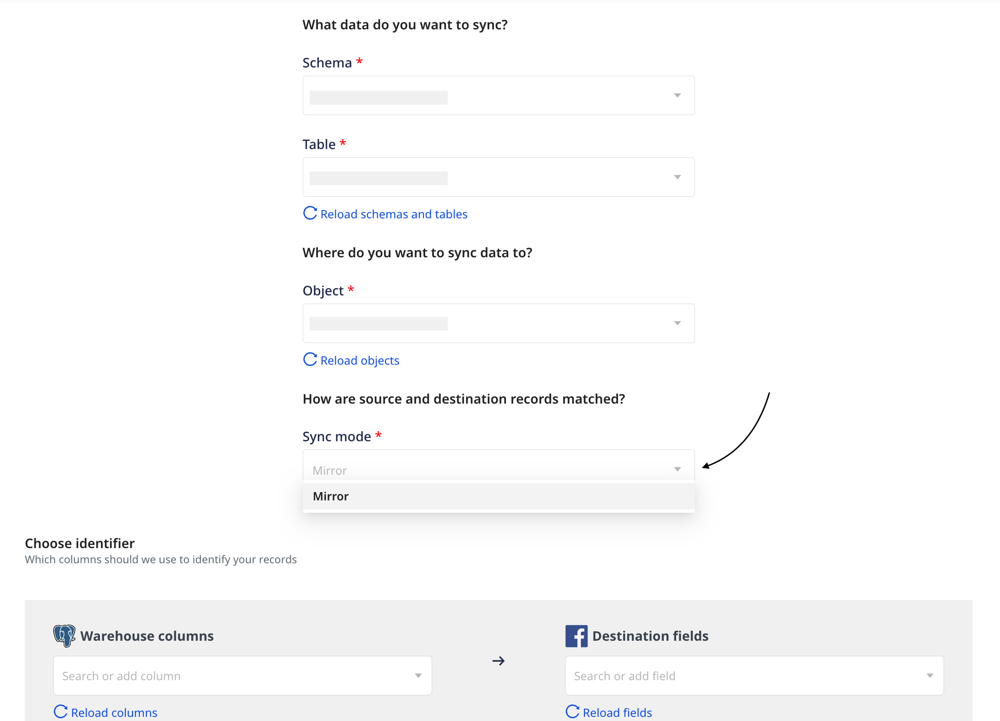

# Sync Modes

The Warehouse Actions sources currently support two modes (available based on the source and the chosen destination) that let you define how you want to sync your data. These are **Upsert** and **Mirror mode**.

By default, both these modes sync the data incrementally, meaning they sync only the new data. However, you also have the option to run a full sync manually.

The following sections explain these data sync modes in detail.

## Upsert

In this mode, RudderStack supports insertion of new records and updates to the existing records, while syncing data to the destination.

Whenever the columns mapping is changed, RudderStack runs a full sync the next time.

## Mirror mode

This mode is currently supported only for the <a href="https://www.rudderstack.com/docs/destinations/advertising/fb-custom-audience/">Facebook Custom Audience</a> destination.

In this mode, RudderStack 'mirrors' the source by keeping the destination data the same as the source data. It performs insertion, updates, and deletion of records while syncing data to the destination. 

Whenever the columns mapping is changed, RudderStack runs a full sync the next time.

When performing a full sync in the mirror mode, RudderStack first deletes all the existing records. Then, it syncs the records as per the latest column mappings.

## FAQ

### What happens to the records that have not been successfully sent to the destination in the previous sync?

In case of an unsuccessful delivery, RudderStack retries sending the events in the next sync.

## Contact us

For queries on any of the sections covered in this guide, you can [**contact us**](mailto:%20docs@rudderstack.com) or start a conversation in our [**Slack**](https://rudderstack.com/join-rudderstack-slack-community) community.
