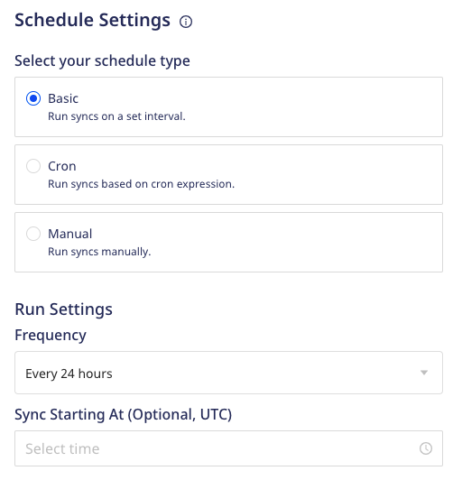
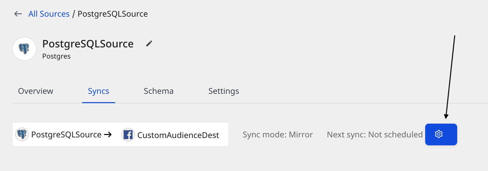

# Sync Schedule Settings

RudderStack lets you schedule data imports from your Warehouse Actions sources while setting them up in your dashboard. It lets you specify the schedule type that defines how and when the syncs will run.

RudderStack supports the following three schedule types:

| Schedule type      | Description                                               |
| :------------------| :---------------------------------------------------------|
| Basic              | Run syncs at a given time interval and specified time.    |
| CRON               | Run syncs based on a CRON expression defined by the user. |
| Manual             | Run syncs manually.                                       |  

This guide explains the above sync schedule settings in detail.

## Basic schedule

This schedule type lets you run the data syncs at a set interval. You can specify the sync frequency as well as the time(in UTC) when you want the sync to start.

You get the following sync frequency options when the schedule type is set to **Basic**:

- 30 minutes
- 1 hour
- 3 hours
- 6 hours
- 12 hours
- 24 hours

### What happens if I don't set the Sync Starting At time?

RudderStack considers strict 1-hour time windows(00:00, 01:00, and so on) to schedule syncs if you do not explicitly set the time under **Sync Starting At**.

Suppose you create a source at 12:30 hrs UTC, specify the **Frequency** as 3 hours, and do not specify any time under **Sync Starting At**. In this case, as the time falls in the 12:00-13:00 time window, RudderStack will run the next sync at 15:00 hrs UTC.

## CRON schedule

This schedule type lets you define a custom CRON expression and runs the data syncs based on this setting. 

You can use the <a href="https://crontab.guru/">CRON scheduler utility</a> to specify your sync schedule.

The sync frequency needs to be greater than or equal to 15 minutes. Otherwise, you will encounter an error as seen below.

## Manual syncs

This schedule type lets you run your data syncs manually. RudderStack won't sync your data until you explicitly trigger it.

To trigger a sync manually, go to the **Syncs** tab in your Warehouse Actions source details page and click on **Sync Now**, as shown:

To programmatically schedule and trigger a sync from outside RudderStack, refer to the <a href="https://www.rudderstack.com/docs/warehouse-actions/airflow-provider/">RudderStack Airflow Provider</a> documentation.

## Sync schedule considerations

The following considerations must be kept in mind while setting a sync schedule in RudderStack, depending on the sync modes:

### Upsert mode

For [upsert mode](https://www.rudderstack.com/docs/warehouse-actions/common-settings/sync-modes/#upsert), you can trigger a new sync anytime by pressing the **Sync Now** button. 

RudderStack takes a snapshot of the data and syncs it at a later point once the pending syncs are completed.

### Mirror mode

For [mirror mode](https://www.rudderstack.com/docs/warehouse-actions/common-settings/sync-modes/#mirror-mode), you can run only one sync at any given point of time. 

Suppose you have a sync scheduled for every 30 minutes. If there is a sync running for more than 30 minutes, then the next scheduled sync will be skipped.

## FAQ

### Can I change my sync schedule type?

Yes, you can. 

1. Go to the **Syncs** tab in your Warehouse Actions source details page and click on the settings button as shown:

2. Then, select your new sync schedule type.

Alternatively, you can also go to the **Settings** tab and click on the **Edit sync schedule** button to define your new schedule type.

### I'm unable to run a sync manually and get the message "Your pipeline is paused. Make sure that the source and at least one destination is enabled". What do I do?

This message appears when either your Warehouse Actions source, the connected destination, or both are disabled. Go to the **Settings** tab to verify if the source and destination are enabled for data syncs.

## Contact us

For queries on any of the sections covered in this guide, you can [**contact us**](mailto:%20docs@rudderstack.com) or start a conversation in our [**Slack**](https://rudderstack.com/join-rudderstack-slack-community) community.
