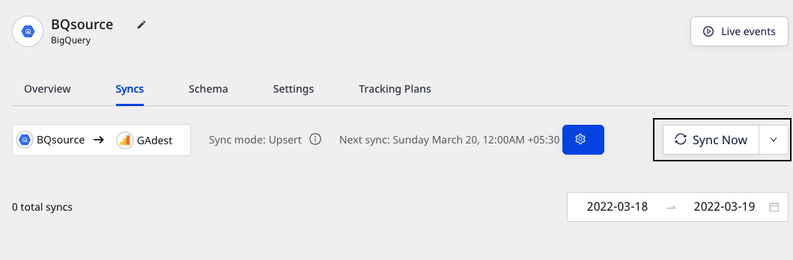

# Sync Schedule Settings

RudderStack lets you schedule data imports from your Warehouse Actions sources while setting them up in your dashboard. It lets you specify the schedule type that define how and when the syncs will run.

The three schedule types are listed in the following table:

| Schedule type | Description |
| :--------------| :------------|
| Basic                | Run syncs at a given time interval and specified time. |
| CRON               | Run syncs based on a CRON expression defined by the user. |
| Manual             | Run syncs manually.                                                  |  

The guide explains these sync schedule settings in detail.

## Basic schedule

This schedule type lets you run the data syncs on a set interval. You can specify the sync frequency as well as the time(in UTC) you want the sync to start.

## CRON schedule

This schedule type lets you define a custom CRON expression and runs the data syncs based on this setting. 

You can use the <a href="https://crontab.guru/">CRON schedule utility</a> to specify your sync schedule.

## Manual syncs

This schedule type lets you run your data syncs manually. RudderStack won't sync your data until you explicitly trigger it.

To trigger a sync manually, go to the **Syncs** tab in your Warehouse Actions source details page and click on **Sync Now**, as shown:

## FAQ

### Can I change my sync schedule type?

Yes, you can. 

1. Go to the **Syncs** tab in your Warehouse Actions source details page and click on the settings button as shown:

2. Then, select your new sync schedule type.

Alternatively, you can also go to the **Settings** tab and click on the **Edit sync schedule** button to define your new schedule type.

### I'm getting a "Your pipeline is paused. Make sure that the source and at least one destination is enabled" message. What do I do?

This message appears when either your Warehouse Actions source, the connected destination, or both are disabled. Go to the **Settings** tab to verify if the source and destination are enabled for data syncs to occur.

## Contact us

For queries on any of the sections covered in this guide, you can [**contact us**](mailto:%20docs@rudderstack.com) or start a conversation in our [**Slack**](https://rudderstack.com/join-rudderstack-slack-community) community.
