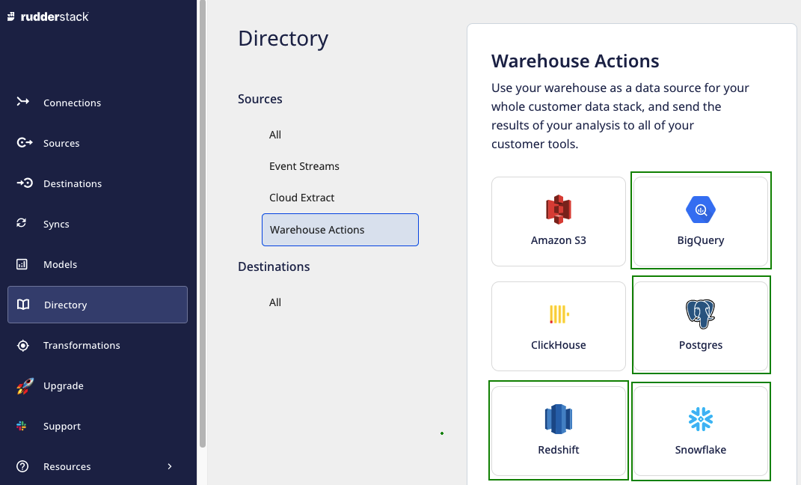
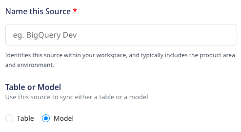
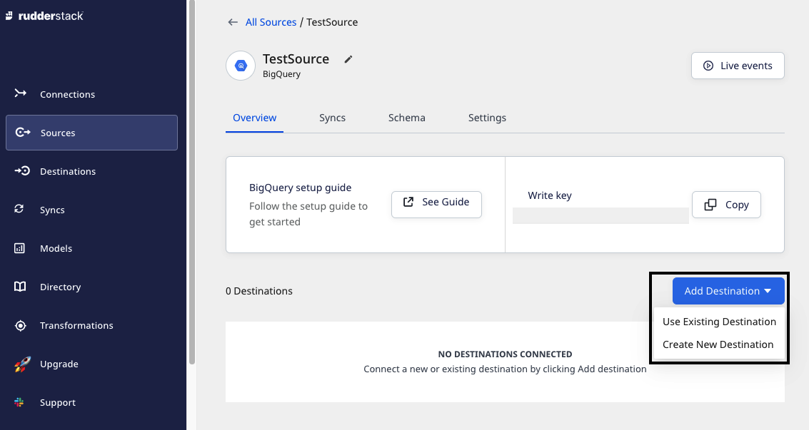
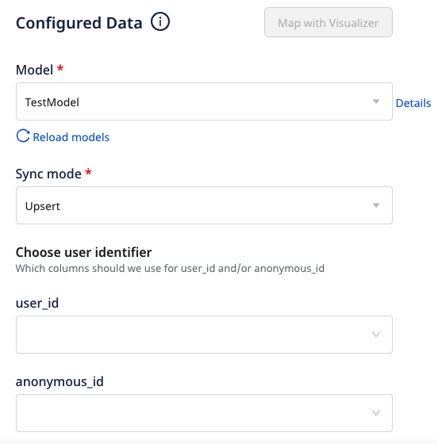
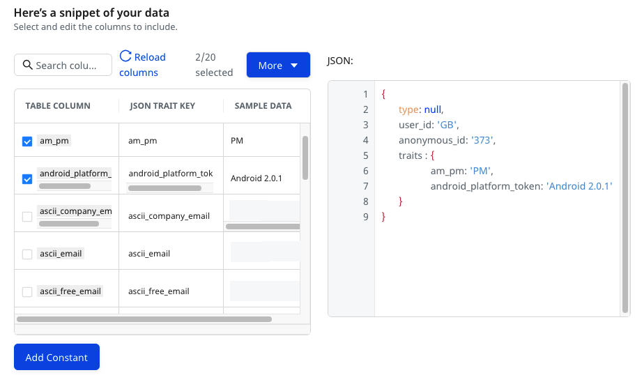
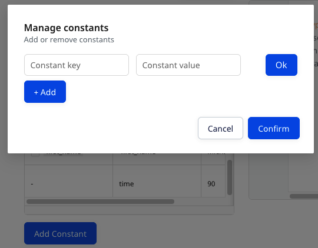
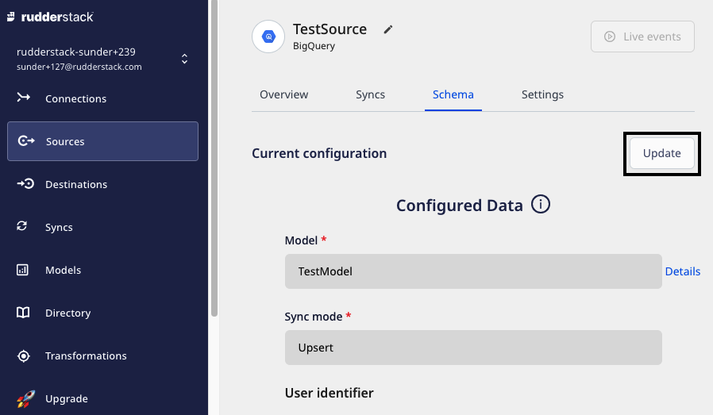

# Custom SQL Models

The **Custom SQL Models** feature provides the capability to define custom SQL queries over the existing tables in Warehouse Actions sources and execute them to send the resultant data to the specified destinations. You can also define the sync schedule to sync the data to destinations as required.

Some of the salient features of custom SQL Models are:
* Manage the view of all **Models** synced to different destinations at one place
* Reuse existing **Models** in multiple connections
* Build complex **Models** using an intuitive UI (RudderStack dashboard)

  Currently, the <strong>Custom SQL Models</strong> are supported for <a href="https://www.rudderstack.com/docs/warehouse-actions/amazon-redshift/">Amazon Redshift</a>, <a href="https://www.rudderstack.com/docs/warehouse-actions/google-bigquery/">Google BigQuery</a>, <a href="https://www.rudderstack.com/docs/warehouse-actions/postgresql/">PostgreSQL</a>, and <a href="https://www.rudderstack.com/docs/warehouse-actions/snowflake/">Snowflake</a> Warehouse Actions sources only.

The Warehouse Actions source being used must have the necessary permissions to be integrated with RudderStack. For more information on these permissions, refer to the <a href="https://www.rudderstack.com/docs/warehouse-actions/">Granting Permissions</a> section of the relevant Warehouse Actions source.

## How to use Custom SQL Models? 

You can create a **Model** in RudderStack dashboard and use it while creating a connection between Warehouse Actions source and destination. For detailed steps on how to create a model, refer to <a href="https://www.rudderstack.com/docs/rudderstack-cloud/models/">Models</a>.

Once a Model is created, you can use it to send the customized data to a specified destination from a warehouse source. Follow the steps listed below to achieve the same:

1. Log in to the **RudderStack dashboard**.
2. Select **Sources** from the left navigation bar and click on **New Source**.
3. Select **Warehouse Actions** and choose any supported source as highlighted below: 

4. Name the source and select the **Model** option while configuring its settings.

4. Once the source is set up, you can connect it to an existing or new destination by using the **Add Destination** button.  

5. Select the required destination and configure its connection settings.
6. Next, select the desired **Model** from the dropdown list.

The dropdown will only display the list of <strong>Models</strong> corresponding to the source you have configured. For example, only the BigQuery Models will be listed in the dropdown for a BigQuery warehouse source. Also, you need to use the same credentials for the source and the model.

7.Select the **Sync mode** and at least one user identifier (**user_id/anonymous_id**) from the dropdown list.

You can preview the data snippet which will be sent to the destination. All the table columns are selected by default. However, you can choose to keep the desired table columns by searching and selecting/deselecting them. The resultant JSON can be previewed on the right.

As can be observed, the JSON payload carries the <strong>user_id</strong> and <strong>anonymous_id</strong> from the table columns selected in the <strong>Choose user identifier</strong> section. The traits are further used from the selected columns in the 'Table Column' section.

You can use the **Add Constant** option to add a constant key and value pair which is always sent in the JSON payload.

7. Click on **Continue** to configure the model successfully with the source and destination.

### Setting the data update schedule

You can click on the **Source** and select the **Syncs** tab to schedule the event data sync. To know more, refer to [Syncs]() 

### Update the selection of table columns  

You can update the selection of table columns used to send data to the specified destinations. 

1. Click on the Source and select the **Schema** tab.
2. Click on **Update** button.

3. Update your selection of table columns and click on **Save** button.

## FAQs

### What do the three validations under Verifying Credentials imply?

When setting up a Warehouse Actions source, once you proceed after entering the connection credentials, you will see the following three validations under the **Verifying Credentials** option:

These options are explained below:

* **Verifying Connection**: This option indicates that RudderStack is trying to connect to the warehouse with the information specified in the connection credentials. 

If this option gives an error, it means that one or more fields specified in the connection credentials are incorrect. Verify your credentials in this case.

* **Able to List Schema**: This option checks if RudderStack is able to fetch all the schema details using the provided credentials. 
* **Able to Access RudderStack Schema**: This option implies that RudderStack is able to access the `rudderstack_` schema that you have created by successfully running all the commands in the [**User Permissions**](https://rudderstack.com/docs/warehouse-actions/google-bigquery#granting-permissions) section. 

If this option gives an error, verify if you have successfully created the `rudderstack_` schema and given RudderStack the required permissions to access it. For more information, refer to [**this section**](https://rudderstack.com/docs/warehouse-actions/google-bigquery#creating-the-rudderstack-schema-and-granting-permissions).

## Contact us

If you come across any issues while configuring custom SQL Models, you can [**contact us**](mailto:%20docs@rudderstack.com) or start a conversation in our [**Slack**](https://rudderstack.com/join-rudderstack-slack-community) community.
