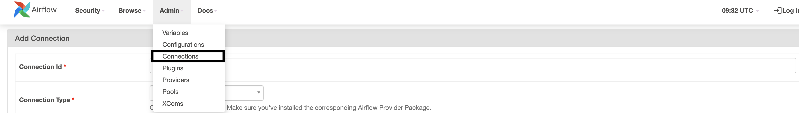
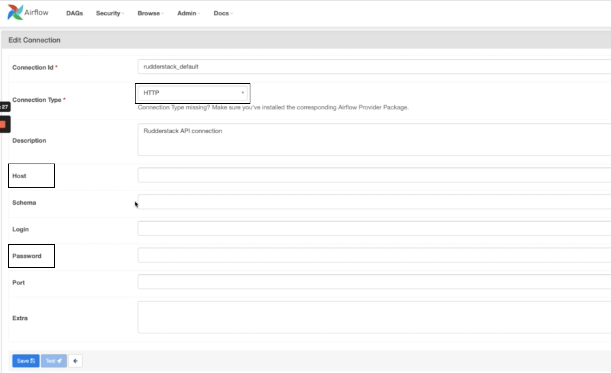
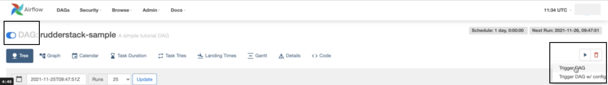

# Airflow Provider

RudderStack's Airflow Provider lets you schedule and trigger your [**Warehouse Actions**](https://rudderstack.com/docs/warehouse-actions/) syncs from outside RudderStack and integrate them with your existing Airflow workflows.

## Using the RudderStack Airflow Provider

<div class="infoBlock">

To use the RudderStack Airflow Provider, you must have a working Apache Airflow installation. For more information, refer to the <a href="https://airflow.apache.org/docs/apache-airflow/stable/installation/index.html">Airflow documentation</a>.
</div>

To use the RudderStack Airflow Provider, follow the steps listed in the sections below:

### Running Airflow

Initialize all the dependencies by running Apache Airflow via the following command:

```bash
airflow standalone
```

<div class="warningBlock">
 
The Airflow standalone server is not meant for use in production. We highly recommend using alternate methods to install and run Airflow in a production environment.
</div>

### Installing Airflow Provider

Install the RudderStack Airflow Provider by running the following commands:

```bash
pip install rudderstack-airflow-provider
```

### Creating an Airflow connection

To create a new Airflow connection, follow these steps:

- Go to your Airflow dashboard and in the **Admin** tab, select **Connections**:



- Add a new connection by configuring the following details:

   - **Connection ID**: Specify a unique connection name. `RudderstackOperator` will pick the connection with the name `rudderstack_default` by default. If you have created a connection with a different name, make sure that name is passed as a parameter to `RudderstackOperator`.

   - **Connection Type**: For this field, select **HTTP** from the list.

   - **Host**: Set the value for this field to `https://api.rudderstack.com`.

   - **Password**: Enter your Personal Access Token here.



<div class="infoBlock">

For more information on obtaining the Personal Access Token, refer to <a href="https://rudderstack.com/docs/transformations/api-access-token/">this guide</a>.
</div>

### Defining a DAG

The next step is to define a DAG with any number of tasks as per your requirement. 

The following code snippet highlights an Airflow DAG with one task named `rs_trigger_sync` for the source ID `20dQV6yuUDUw31peWA8f7xxgHdN`:

```python
from datetime import datetime, timedelta

from airflow import DAG
from rudder_airflow_provider.operators.rudderstack import RudderstackOperator

default_args = {
    'owner': 'airflow',
    'depends_on_past': False,
    'email': ['airflow@example.com'],
    'email_on_failure': False
}

with DAG(
    'rudderstack-sample',
    default_args=default_args,
    description='A simple tutorial DAG',
    schedule_interval=timedelta(days=1),
    start_date=datetime(2021, 1, 1),
    catchup=False,
    tags=['rs']
) as dag:
    rs_operator = RudderstackOperator(
        source_id='20dQV6yuUDUw31peWA8f7xxgHdN',
        connection_id='rudderstack_sync_conn',
        task_id='rs_trigger_sync'
    )
```

<div class="infoBlock">

For more information on where to find the source ID, refer to <a href="https://rudderstack.com/docs/connections/#source-details">this guide</a>.
</div>

### Running the DAG

Once you have defined a DAG and configured an Airflow connection, run the following commands to allow Airflow to pick up and run the DAG:

```bash
export AIRFLOW_HOME=</path/to/airflow_home>
mkdir $AIRFLOW_HOME/dags
cp rudderstack_dag.py $AIRFLOW_HOME/dags
```

**Make sure the Airflow scheduler is running in the background**. Also, you must enable the DAG in the Airflow dashboard, as shown:



<div class="infoBlock">

You can trigger a DAG by clicking on the play button on the right as seen above, and selecting <strong>Trigger DAG</strong>. Note that <strong>stopping the DAG will not cancel the ongoing sync</strong>.
</div>

## Contact us

For queries on any of the sections covered in this guide, you can [**contact us**](mailto:%20docs@rudderstack.com) or start a conversation in our [**Slack**](https://rudderstack.com/join-rudderstack-slack-community) community.
