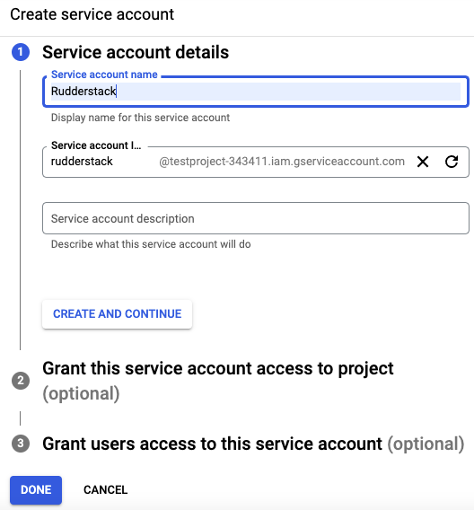

# Google BigQuery

[Google BigQuery](https://cloud.google.com/bigquery) is an industry-leading, fully-managed cloud data warehouse that lets you store and analyze petabytes of data in no time.

RudderStack supports Google BigQuery as a source from which you can ingest enriched user information and route it to your desired downstream destinations.

## Granting permissions

RudderStack requires some necessary permissions on your warehouse to access data from it successfully.

The below-mentioned SQL queries can be executed on the **BigQuery Console** in the **exact** order to grant these necessary permissions:

### Step 1: Creating a role and granting permissions

1. Go to the [Roles](https://console.cloud.google.com/iam-admin/roles) section of Google Cloud Platform dashboard and click on **CREATE ROLE**.


2. Fill in the details as shown:


3. Click on **ADD PERMISSIONS** and add the permissions as listed in the following image:


The permissions are as shown below:

```
bigquery.datasets.get
bigquery.jobs.create
bigquery.jobs.list
bigquery.tables.create
bigquery.tables.get
bigquery.tables.getData
bigquery.tables.list
bigquery.tables.update
bigquery.tables.updateData
```

4. Finally, click on **CREATE**.

### Creating a service account & attaching the role to it

1. Go to [Service Accounts](https://console.cloud.google.com/iam-admin/serviceaccounts) and select the project which has the dataset or the table that you want to use.
2. Click on **CREATE SERVICE ACCOUNT**.


3. Fill in the **Service Account details** as shown below, and click on **CREATE AND CONTINUE**:



<div class="infoBlock">

Note down the **Service account ID**. This ID is required while creating the RudderStack schema and granting the required permissions to it.
</div>

4. Fill in the Role details as shown below, and click on **CONTINUE**:


5. Click on **DONE** to move to the list of service accounts.

### Creating and downloading the JSON key

1. Click on the three dots icon under **Actions** in the service account that you just created and select **Manage keys**, as shown:


2. Click on **ADD KEY**, followed by **Create new key**, as shown:


3. Select **JSON** and click on **CREATE**.


A JSON file will be downloaded on your system. This file is required while creating a BigQuery warehouse source in RudderStack, explained in the next section.

### Creating the RudderStack schema and granting permissions

1. Go to the [BigQuery SQL workspace](https://console.cloud.google.com/bigquery) and run the following command to create a dedicated schema `rudderstack_` for storing the state of each data sync.

```sql
create schema rudderstack_;
```

2. Grant full access to the `rudderstack_` \(used by RudderStack\) schema over the `Rudderstack` service account.

```sql
GRANT `roles/bigquery.dataOwner`
     ON SCHEMA rudderstack_
     TO "serviceAccount:<SERVICE_ACCOUNT_ID>";
```
## Setting up BigQuery as source

The below section explains the detailed steps to set up BigQuery as a source in RudderStack.

### Step 1: Naming the source

1. Log into your [RudderStack dashboard](https://app.rudderlabs.com/signup?type=freetrial).

2. Select **Sources** from the left panel. Then, click on **New source**, as shown:


3. Click on the **Warehouse Actions** and select **BigQuery**.


4. Assign a name to the source and click on **Continue**.


### Step 2: Configuring the source credentials

1. Choose the relevant option from **Table** or **Model** to use the source to sync either a table or a model.

<div class="infoBlock">

For more information on the difference between the <strong>Table</strong> and <strong>Model</strong> options when creating a Warehouse Actions source, refer to the <a href="#faq">FAQ</a> section below.
</div>

2. Click on **Create Credentials from Scratch** and enter the relevant details in the **Connection Credentials**:


- **Credentials** - GCP Service Account credentials JSON for RudderStack to use in loading data into your BigQuery database
- **Project ID** - GCP Project ID where your BigQuery database is located.
- **Service account** - service account ID

<div class="successBlock">

  If you've configured BigQuery as a source before, you can select the existing
  credentials from <strong>Use existing credentials</strong>, as shown:


</div>

2. Click on **Continue** to verify your credentials. For more information, refer to [FAQ section](https://www.rudderstack.com/docs/warehouse-actions/clickhouse/#faq). Once verified, click on **Continue** again.

### Step 3: Setting the data update schedule

1. Specify the **Schedule Settings** to schedule the data import from your ClickHouse instance to RudderStack. 

<div class="infoBlock">

For more information on these settings, refer to <a href = "https://www.rudderstack.com/docs/warehouse-actions/common-settings/sync-schedule-settings/">Sync Schedule Settings</a>.
</div>


2. Click on **Continue** to configure the source successfully.

<div class="infoBlock">

 You can further connect the source to your preferred destination by clicking on <strong>Add Destination</strong>, as shown:


</div>

## FAQs

### What do the three validations under Verifying Credentials imply?

When setting up a Warehouse Actions source, once you proceed after entering the connection credentials, you will see the following three validations under the **Verifying Credentials** option:


These options are explained below:

* **Verifying Connection**: This option indicates that RudderStack is trying to connect to the warehouse with the information specified in the connection credentials. 

<div class="warningBlock">

If this option gives an error, it means that one or more fields specified in the connection credentials are incorrect. Verify your credentials in this case.
</div>

* **Able to List Schema**: This option checks if RudderStack is able to fetch all the schema details using the provided credentials. 
* **Able to Access RudderStack Schema**: This option implies that RudderStack is able to access the `rudderstack_` schema that you have created by successfully running all the commands in the [**User Permissions**](https://rudderstack.com/docs/warehouse-actions/google-bigquery#granting-permissions) section. 

<div class="warningBlock">

If this option gives an error, verify if you have successfully created the `rudderstack_` schema and given RudderStack the required permissions to access it. For more information, refer to [**this section**](https://rudderstack.com/docs/warehouse-actions/google-bigquery#creating-the-rudderstack-schema-and-granting-permissions).
</div>

### What is the difference between the Table and Model options when creating a Warehouse Actions source?

When creating a new Warehouse Actions source, you are presented with the following two options from which RudderStack will sync the data:


- When you choose **Table**, RudderStack imports all the data associated with the specified table during the sync.
- When you choose **Model**, RudderStack imports the data by running the query specified in the connected model, during the sync.

## Contact us

For queries on any of the sections covered in this guide, you can [**contact us**](mailto:%20docs@rudderstack.com) or start a conversation in our [**Slack**](https://rudderstack.com/join-rudderstack-slack-community) community.
