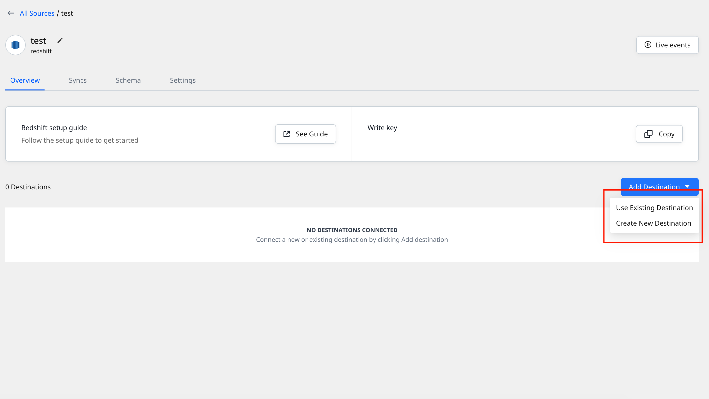
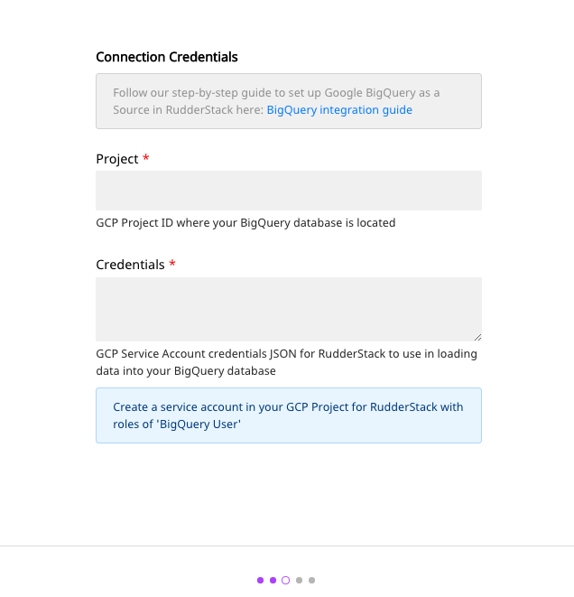
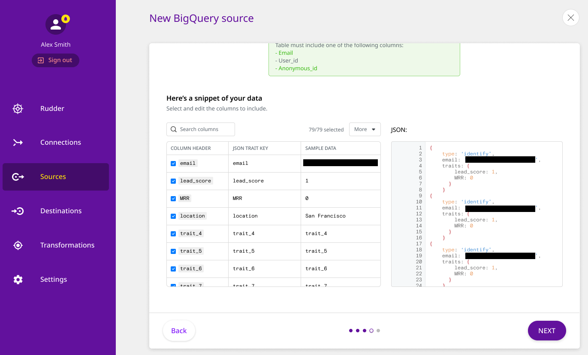
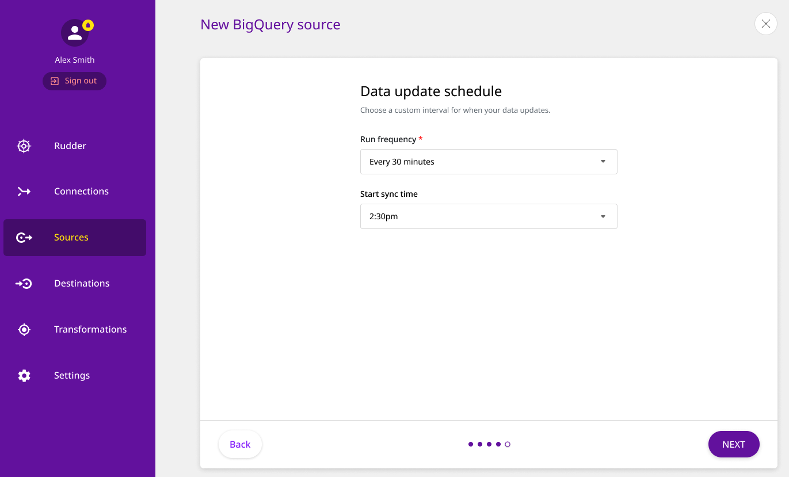
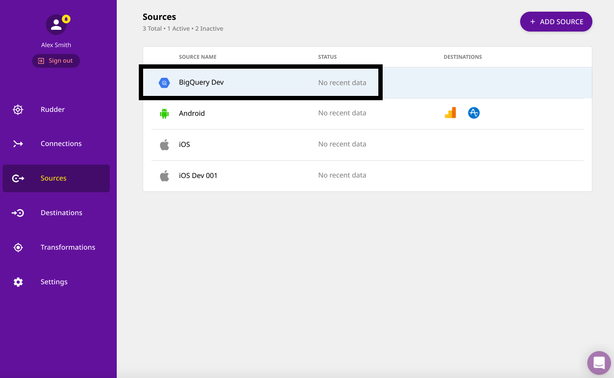
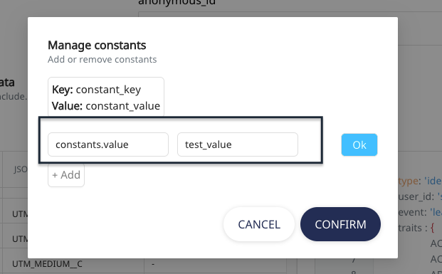
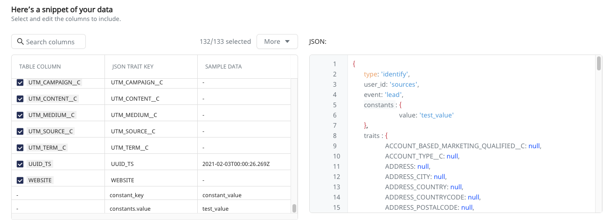

# Warehouse Actions Sources

## What are Sources in RudderStack?

Sources are the tools or platforms from which you can send event data to RudderStack. These events can then be routed \(with or without transformation\) into your data warehouse or third-party destinations for analytics and other activation use-cases.

With this feature, you can configure your data warehouse as a source in the [**RudderStack dashboard**](https://app.rudderlabs.com/signup?type=freetrial), select the right data and then sync this data to all the supported destinations.

  For more information on sources in RudderStack, check out the
  <a href="https://rudderstack.com/docs/connections/">Connections guide</a>.

## RudderStack Warehouse Actions

With RudderStack **Warehouse Actions**, you can leverage the already processed customer data residing in your data warehouse and route this enriched information to your desired destinations.

With this feature, you can configure your data warehouse as a source on the <a href="https://app.rudderlabs.com/signup?type=freetrial">RudderStack dashboard</a>, select the right data and then sync this data to all the supported destinations.

**You can connect only one destination to a Warehouse Actions source**. Also, note that this destination **should not be connected to any other source** \(including [**Event Stream**](https://rudderstack.com/docs/stream-sources/) sources.\)

If you want to send data from a warehouse source to multiple destinations, we recommend creating multiple copies of the source with the same settings and connect them with each of the destinations.

**You cannot connect a Warehouse Actions source to a warehouse destination in RudderStack.**

Here's a detailed walkthrough of the Warehouse Actions feature:

<!--https://www.youtube.com/watch?v=krFbHHjX-AU-->

<YouTube 
  videoId={'krFbHHjX-AU'}
  opts={{playerVars: {rel: 0}}}
/>

## Configuring Warehouse Actions on RudderStack

**The** **Warehouse Actions** **feature supports only source-driven configuration of your data pipeline**. 

So, you need to configure a Warehouse Actions source in RudderStack first, and then connect it to a new or existing destination \(the existing destination should not be connected to any other source\), as shown below.

<!---->

To configure your data warehouse as a source on the RudderStack dashboard, follow these steps:

- Log into your [**RudderStack dashboard**](https://app.rudderlabs.com/signup?type=freetrial).
- Navigate to **Sources**, present in the left panel of the dashboard.
- Choose your preferred data warehouse which you want to configure as a source, as shown. Then, click on **Next**.

### Specifying Connection Credentials

- Assign a name to your source. Then, click on the **Create credentials from scratch** button, if you are configuring your data warehouse in the RudderStack dashboard for the first time.

If you have previously configured your data warehouse as a source on the RudderStack dashboard, you can simply use the existing credentials and proceed.

- Next, enter the connection credentials to configure your data warehouse connection with RudderStack, as shown:

RudderStack currently supports **Google BigQuery**, **PostgreSQL**, **ClickHouse**, **Amazon Redshift**, and **Snowflake** as sources. The connection settings will vary according to each warehouse.

### Specifying Warehouse Schema and Table

- Next, enter the data warehouse schema and the table name. RudderStack will collect the data from this table.

Please note that your source table must include at least one of the following columns for it to be considered a valid source:
  
<ul><li><strong>email</strong></li>
<li><strong>user_id</strong></li>
<li><strong>anonymous_id</strong></li></ul>

- If the table is valid, you can then preview a snippet of the data, as shown:

- You can also filter, select and edit the column names of the table to be included as the data source, as shown:

- Once you've selected all the the required table columns, click on **Next**.

### Setting the Data Update Schedule

- RudderStack also allows you to specify the data update frequency and set a data synchronization time as per your requirement.

That's it! Your data warehouse is now configured and added as a RudderStack source.

Currently all events sent to RudderStack via warehouse as a source will be <code class="inline-code">identify()</code> events

Now you can connect this source to any RudderStack destination of your choice. RudderStack will collect the enriched customer data from the specified table columns in your warehouse source and send it to the destination for your activation use-cases.

## Warehouse Actions Constants

Constants give you the ability to add new fields to each event with a pre-defined value. The **key** of a Warehouse Actions constant has the same functionality as modifying an existing column, and is in the format \(**test.value, test.value\[0\]**\).

### How to add a Warehouse Actions constant

Adding a new constant when configuring a Warehouse Actions source is very easy:

- Click on the **Add Constant** button as shown below, while [mapping your table](https://rudderstack.com/docs/warehouse-actions#specifying-warehouse-schema-and-table):

- Add your preferred key and value for the constant, select **Ok** and then click on **Confirm**, as shown:

- The new constant appears in the table and also in the JSON preview inside the traits, as shown:

- You can also use dot notation to define a Warehouse Actions constant, as shown below:

- The result would look something like:

## FAQs

### I cannot add a Warehouse Actions source to an already configured destination. Why?

Warehouse Actions supports only source-driven configuration of your pipeline. So you need to configure a Warehouse Actions source in RudderStack and then connect it an existing, **free** destination \(this destination should not be connected to any other source\), as shown:

<!---->

### Can I connect a Warehouse Actions source to multiple destinations?

We recommend creating a separate Warehouse Actions source with the same settings for each destination where you want to send the data.

### What type of events are supported by the RudderStack Warehouse Actions?

Currently all events from the RudderStack warehouse actions are `identify()` events.

## Popular Sources

<!---->

<a class="pageRef" href="amazon-s3/">
  

    
      <svg
        preserveAspectRatio="xMidYMid meet"
        height="1em"
        width="1em"
        fill="none"
        xmlns="http://www.w3.org/2000/svg"
        viewBox="0 0 24 24"
        strokeWidth="2"
        strokeLinecap="round"
        strokeLinejoin="round"
        stroke="currentColor"
        class="rightRefArrow"
      >
        <g>
          <line x1="5" y1="12" x2="19" y2="12"></line>
          <polyline points="12 5 19 12 12 19"></polyline>
        </g>
      </svg>
    
    
      Amazon S3
    
  

</a>

<!---->

<a class="pageRef" href="snowflake/">
  

    
      <svg
        preserveAspectRatio="xMidYMid meet"
        height="1em"
        width="1em"
        fill="none"
        xmlns="http://www.w3.org/2000/svg"
        viewBox="0 0 24 24"
        strokeWidth="2"
        strokeLinecap="round"
        strokeLinejoin="round"
        stroke="currentColor"
        class="rightRefArrow"
      >
        <g>
          <line x1="5" y1="12" x2="19" y2="12"></line>
          <polyline points="12 5 19 12 12 19"></polyline>
        </g>
      </svg>
    
    
      Snowflake
    
  

</a>

<!---->

<a class="pageRef" href="amazon-redshift/">
  

    
      <svg
        preserveAspectRatio="xMidYMid meet"
        height="1em"
        width="1em"
        fill="none"
        xmlns="http://www.w3.org/2000/svg"
        viewBox="0 0 24 24"
        strokeWidth="2"
        strokeLinecap="round"
        strokeLinejoin="round"
        stroke="currentColor"
        class="rightRefArrow"
      >
        <g>
          <line x1="5" y1="12" x2="19" y2="12"></line>
          <polyline points="12 5 19 12 12 19"></polyline>
        </g>
      </svg>
    
    
      Amazon Redshift
    
  

</a>

<!---->

<a class="pageRef" href="google-bigquery/">
  

    
      <svg
        preserveAspectRatio="xMidYMid meet"
        height="1em"
        width="1em"
        fill="none"
        xmlns="http://www.w3.org/2000/svg"
        viewBox="0 0 24 24"
        strokeWidth="2"
        strokeLinecap="round"
        strokeLinejoin="round"
        stroke="currentColor"
        class="rightRefArrow"
      >
        <g>
          <line x1="5" y1="12" x2="19" y2="12"></line>
          <polyline points="12 5 19 12 12 19"></polyline>
        </g>
      </svg>
    
    
      Google BigQuery
    
  

</a>

<!---->

<a class="pageRef" href="postgresql/">
  

    
      <svg
        preserveAspectRatio="xMidYMid meet"
        height="1em"
        width="1em"
        fill="none"
        xmlns="http://www.w3.org/2000/svg"
        viewBox="0 0 24 24"
        strokeWidth="2"
        strokeLinecap="round"
        strokeLinejoin="round"
        stroke="currentColor"
        class="rightRefArrow"
      >
        <g>
          <line x1="5" y1="12" x2="19" y2="12"></line>
          <polyline points="12 5 19 12 12 19"></polyline>
        </g>
      </svg>
    
    
      PostgreSQL
    
  

</a>

## Contact Us

To know more about RudderStack's Warehouse Actions feature, feel free to [**contact us**](mailto:%20docs@rudderstack.com) or start a conversation on our [**Slack**](https://rudderstack.com/join-rudderstack-slack-community) channel.
