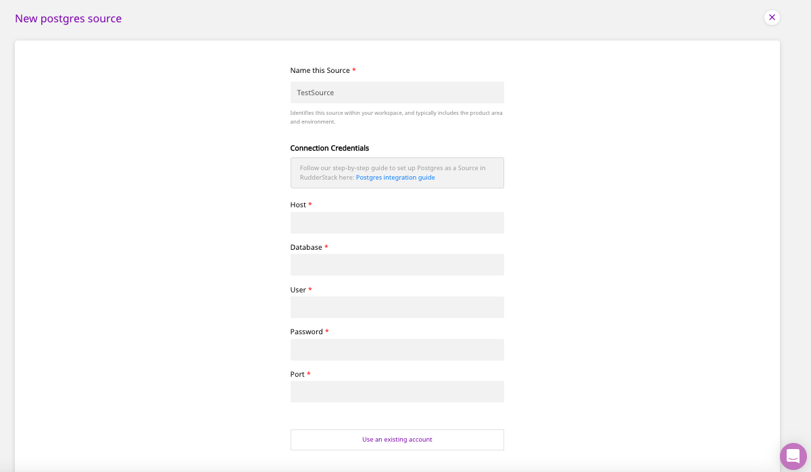
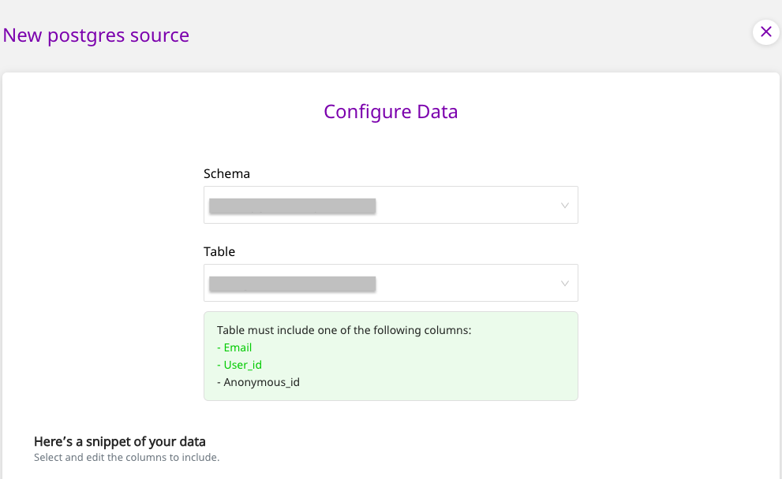
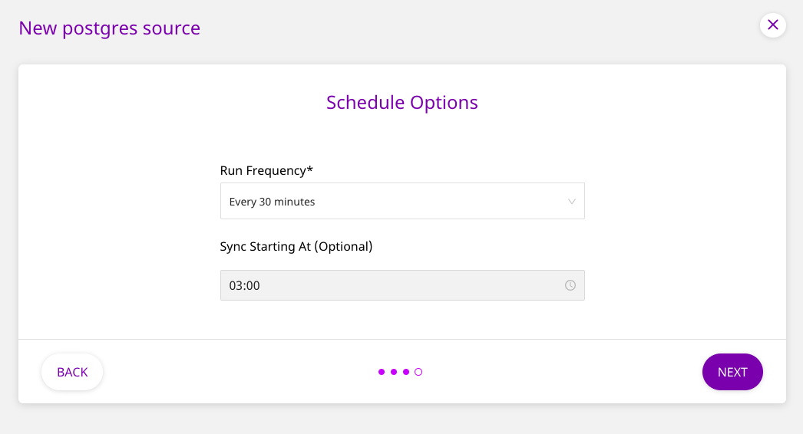
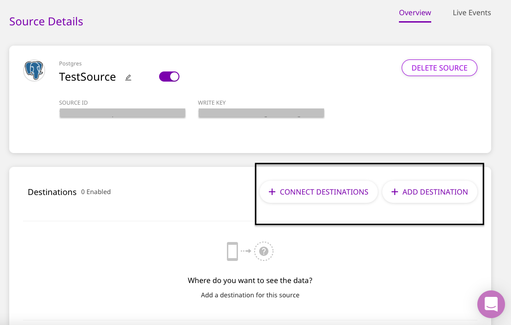

# PostgreSQL

PostgreSQL is an enterprise-grade, open source database management system. It supports both SQL and JSON for relational and non-relational queries respectively. Many companies in the market use PostgreSQL as their low-cost data warehousing solution to deliver efficient analytics and user insights. A myriad of other analytical tools in the market also integrate seamlessly with PostgreSQL. In fact, Amazon Redshift's design is inspired from PostgreSQL.

This guide will help you configure PostgreSQL as a source from which you can route event data to your desired destinations through RudderStack.

## Granting Permissions

Run the following SQL queries to grant the necessary permissions for warehouse action

```text
CREATE USER RUDDER WITH PASSWORD 'strong_unique_password'
GRANT USAGE ON SCHEMA "testschema" TO RUDDER;
GRANT SELECT ON TABLE "testschema"."testtable" to RUDDER;
GRANT CREATE ON SCHEMA "testschema" to RUDDER;
```

## Set Up as Source

To set up PostgreSQL as a source in RudderStack, follow these steps:

* Log into your [RudderStack dashboard](https://app.rudderlabs.com/signup?type=freetrial).
* From the left panel, select **Sources**. Then, click on **Add Source**, as shown:


* Scroll down to the **Warehouse Sources** and select **PostgreSQL**. Then, click on **Next**.


### Setting Up the Connection

* Assign a name to your source, and enter the **Connection Credentials**, as mentioned below. Then, click on **Next**.




If you've already configured PostgreSQL as a source before, your existing credentials will automatically appear under **Use Existing Credentials**.


* The connection credentials are as follows:
  * **Host -** The host name of your PostgreSQL service.
  * **Database -** The database name in your PostgreSQL instance where the data is loaded.
  * **User** - The username which has the required read/write access to the above database.
  * **Password** - The password for the above user should be specified here.
  * **Port** - The port number of your PostgreSQL service.

### Specifying the Data to Import

* Next, select the **Schema** and the **Table** from which you want RudderStack to import the data.




Your table must include one of the following columns - `email`, `user_id`, or `anonymous_id`.


* Once you specify the table containing the required columns, you will be able to preview a snippet of your data, as shown below:


* Here, you can select all or only a few specific columns of your choice, search the columns by a keyword, and also edit the **JSON Trait Key**, as shown below. You can also preview the resultant JSON on the right. Once you've select the required table columns to import the data from, click on **Next**.


### Setting the Data Update Schedule

* Next, you will be required to set the **Run Frequency** to schedule the data import from your PostgreSQL database to RudderStack. You can also specify the time when you want this synchronization to start, by choosing the time under the **Sync Starting At** option. Then, click on **Next**.



That's it! PostgreSQL is now successfully configured as a source on your RudderStack dashboard.

RudderStack will start importing data from your PostgreSQL database as per the specified frequency. You can further connect this source to your preferred destinations by clicking on **Connect Destinations** or **Add Destinations**, as shown:




If you have already configured a destination on the RudderStack platform, choose the **Connect Destinations** option. To add a new destination from scratch, you can select the **Add Destination** option.


## Contact Us

If you come across any issues while configuring PostgreSQL as a source on the RudderStack dashboard, please feel free to [contact us](mailto:%20docs@rudderstack.com). You can also start a conversation on our [Slack](https://resources.rudderstack.com/join-rudderstack-slack) channel; we will be happy to talk to you!

