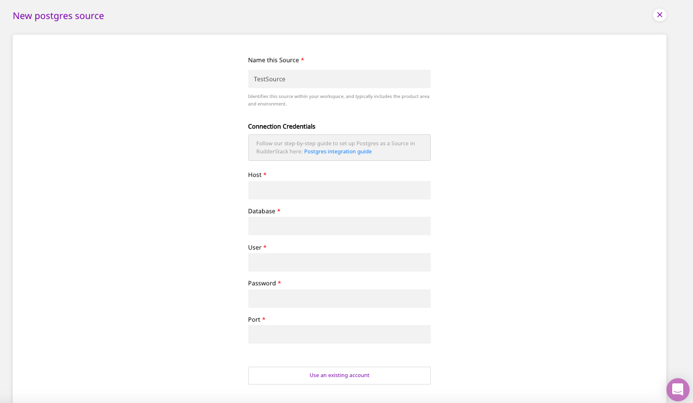
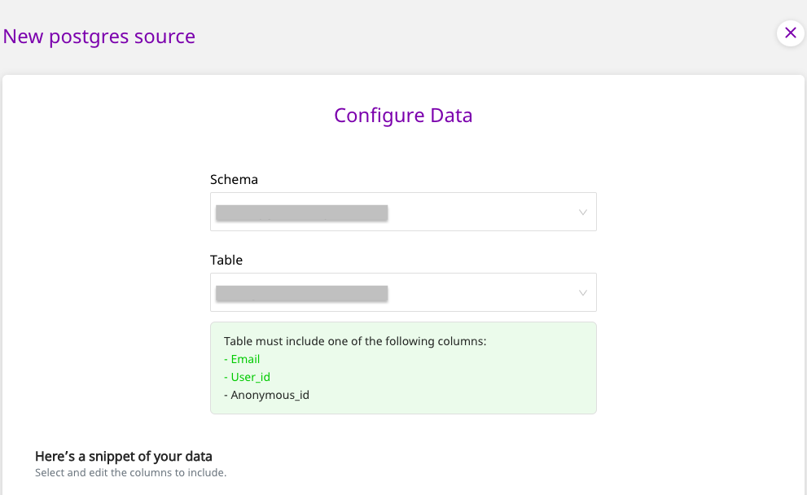
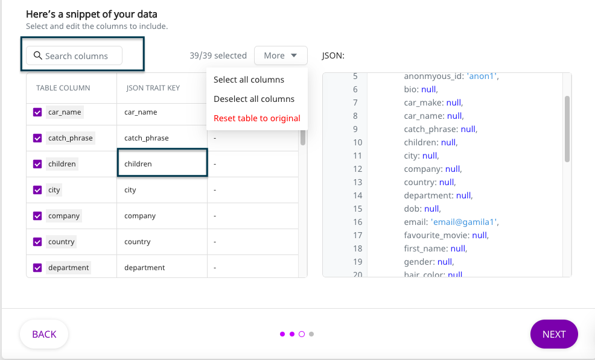
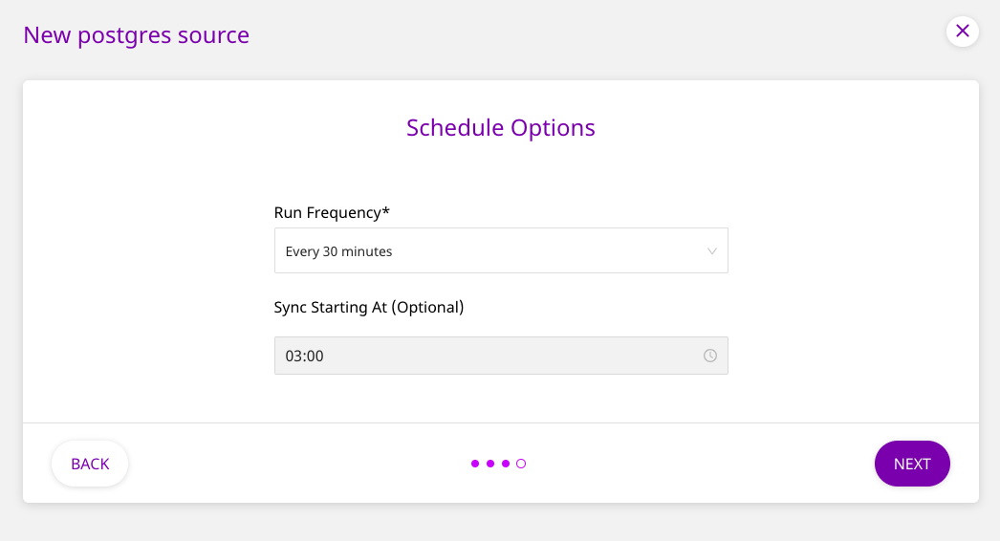
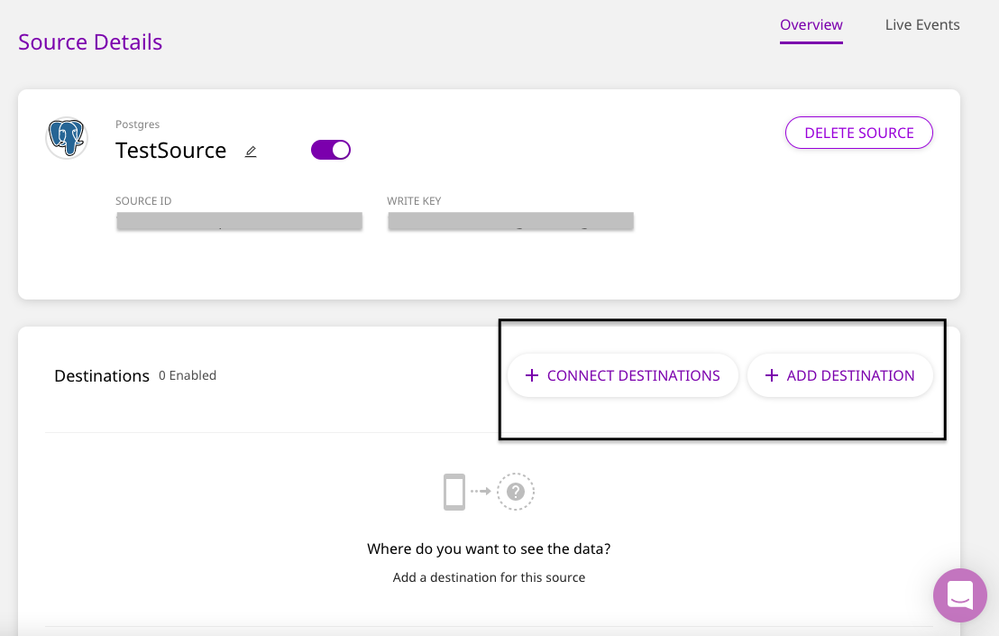
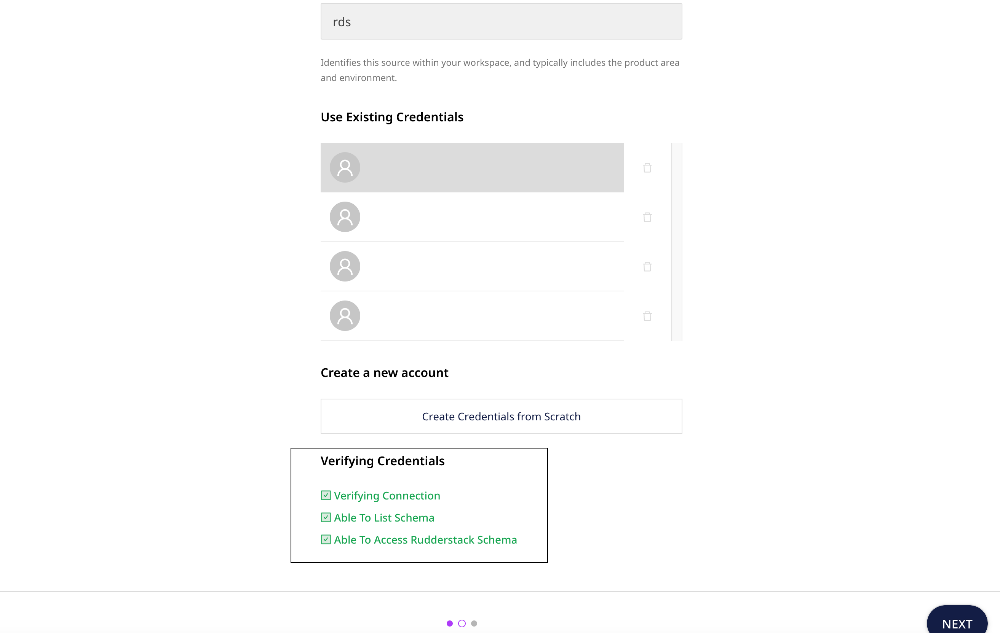

# PostgreSQL

PostgreSQL is an enterprise-grade, open source database management system. It supports both SQL and JSON for relational and non-relational queries respectively. Many companies in the market use PostgreSQL as their low-cost data warehousing solution to deliver efficient analytics and user insights. A myriad of other analytical tools in the market also integrate seamlessly with PostgreSQL. In fact, Amazon Redshift's design is inspired from PostgreSQL.

This guide will help you configure PostgreSQL as a source from which you can route event data to your desired destinations through RudderStack.

## Granting User Permissions

Run the SQL queries below in the **exact order** to grant the necessary permissions for the Warehouse Actions source:

### Creating the user

* The following command creates a new user `rudder` with password `<strong_unique_password>` in PostgreSQL.

```
CREATE USER rudder WITH PASSWORD '<strong_unique_password>';
```

### Creating the RudderStack schema and granting permissions

* The following command creates a dedicated schema `_rudderstack` used by RudderStack for storing the state of each data sync.

```
CREATE SCHEMA "_rudderstack";
```

<div class="warningBlock">

The `_rudderstack` schema is used by RudderStack. Its name **should not** be changed.
</div>

* This command allows the user `rudder` to have full access to the schema `_rudderstack`:

```
GRANT ALL ON SCHEMA "_rudderstack" TO rudder;
```

* This command lets the user `rudder` to have full access to all the objects in the schema `_rudderstack`.

```
GRANT ALL PRIVILEGES ON ALL TABLES IN SCHEMA "_rudderstack" TO rudder;
```

### Granting permissions on your schema & table

* This command lets the user `rudder` look up objects within the schema `<YOUR_SCHEMA>`. Replace  with the exact name of your PostgreSQL database schema.

```
GRANT USAGE ON SCHEMA "<YOUR_SCHEMA>" TO rudder;
```

* This command allows the user `rudder` to read data from the table `<YOUR_TABLE>`. Replace  and  with the exact name of your database schema and table names in PostgreSQL.

```
GRANT SELECT ON TABLE "<YOUR_SCHEMA>"."<YOUR_TABLE>" TO rudder;
```

* The following **optional** command lets the user `rudder` to read data from all the tables in the schema "":

```
GRANT SELECT ON ALL TABLES IN SCHEMA "<YOUR_SCHEMA>" TO rudder;
```

<div class="warningBlock">

Run the above command only if you're okay with RudderStack being able to access the data in all the tables residing within your specified schema.
</div>

* The following **optional** command allows the user `rudder` to read data from all the future tables in the schema `<YOUR_SCHEMA>`:

```
ALTER DEFAULT PRIVILEGES IN SCHEMA "<YOUR_SCHEMA>" GRANT SELECT ON TABLES TO rudder;
```

<div class="warningBlock">

Run the above command only if you're okay with RudderStack being able to access the data in all the future tables residing within your specified schema.
</div>

## Setting Up the Source

To set up PostgreSQL as a source in RudderStack, follow these steps:

* Log into your [RudderStack dashboard](https://app.rudderlabs.com/signup?type=freetrial).
* From the left panel, select **Sources**. Then, click on **Add Source**, as shown:


* Scroll down to the **Warehouse Sources** and select **PostgreSQL**. Then, click on **Next**.


### Setting Up the Connection

* Assign a name to your source, and enter the **Connection Credentials**, as mentioned below. Then, click on **Next**.



<div class="successBlock">

If you've already configured PostgreSQL as a source before, your existing credentials will automatically appear under **Use Existing Credentials**.
</div>

* The connection credentials are as follows:
  * **Host -** The host name of your PostgreSQL service.
  * **Database -** The database name in your PostgreSQL instance where the data is loaded.
  * **User** - The username which has the required read/write access to the above database.
  * **Password** - The password for the above user should be specified here.
  * **Port** - The port number of your PostgreSQL service.

### Specifying the Data to Import

* Next, select the **Schema** and the **Table** from which you want RudderStack to import the data.



<div class="warningBlock">

Your table must include one of the following columns - `email`, `user_id`, or `anonymous_id`.
</div>

* Once you specify the table containing the required columns, you will be able to preview a snippet of your data, as shown below:


* Here, you can select all or only a few specific columns of your choice, search the columns by a keyword, and also edit the **JSON Trait Key**, as shown below. You can also preview the resultant JSON on the right. Once you've select the required table columns to import the data from, click on **Next**.



### Setting the Data Update Schedule

* Next, you will be required to set the **Run Frequency** to schedule the data import from your PostgreSQL database to RudderStack. You can also specify the time when you want this synchronization to start, by choosing the time under the **Sync Starting At** option. Then, click on **Next**.



That's it! PostgreSQL is now successfully configured as a source on your RudderStack dashboard.

RudderStack will start importing data from your PostgreSQL database as per the specified frequency. You can further connect this source to your preferred destinations by clicking on **Connect Destinations** or **Add Destinations**, as shown:



<div class="infoBlock">

If you have already configured a destination on the RudderStack platform, choose the **Connect Destinations** option. To add a new destination from scratch, you can select the **Add Destination** option.
</div>

## FAQ

### What do the three validations under Verifying Credentials imply?

When setting up a Warehouse Actions source, once you proceed after entering the connection credentials, you will see the following three validations under the **Verifying Credentials** option:



These options are explained below:

* **Verifying Connection**: This option indicates that RudderStack is trying to connect to the warehouse with the information specified in the connection credentials. 

<div class="warningBlock">

If this option gives an error, it means that one or more fields specified in the connection credentials are incorrect. Verify your credentials in this case.
</div>

* **Able to List Schema**: This option checks if RudderStack is able to fetch all the schema details using the provided credentials. 
* **Able to Access RudderStack Schema**: This option implies that RudderStack is able to access the `_rudderstack` schema you have created by successfully running all the commands in the [**User Permissions**](https://rudderstack.com/docs/warehouse-actions/postgresql#creating-the-rudderstack-schema-and-granting-permissions) section. 

<div class="warningBlock">

If this option gives an error, verify if you have successfully created the `_rudderstack` schema and given RudderStack the required permissions to access it. For more information, refer to [**this section**](https://rudderstack.com/docs/warehouse-actions/postgresql#creating-the-rudderstack-schema-and-granting-permissions).
</div>

## Contact Us

If you come across any issues while configuring PostgreSQL as a source on the RudderStack dashboard, please feel free to [contact us](mailto: docs@rudderstack.com). You can also start a conversation on our [Slack](https://rudderstack.com/join-rudderstack-slack-community) channel; we will be happy to talk to you!
