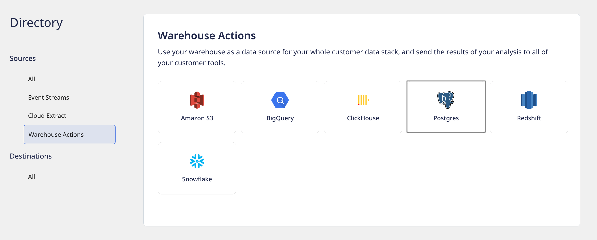

# PostgreSQL

PostgreSQL is an enterprise-grade, open source database management system. Many companies in the market use PostgreSQL as their low-cost data warehousing solution to deliver efficient analytics and user insights.

RudderStack supports PostgreSQL as a source from which you can ingest enriched user information and route it to your desired downstream destinations.

## Granting permissions

Run the SQL queries listed in the following sections in the  **exact order** to grant the necessary user permissions for the PostgreSQL source:

### Step 1: Creating the user

- Create a new user `RUDDER` with password `<strong_unique_password>` in PostgreSQL, as shown:

```sql
CREATE USER RUDDER WITH PASSWORD '<strong_unique_password>';
```

### Step 2: Creating the RudderStack schema and granting permissions

1. Create a dedicated schema `_rudderstack` used by RudderStack for storing the state of each data sync.

```sql
CREATE SCHEMA "_rudderstack";
```

<div class="warningBlock">

The <code class="inline-code">_rudderstack</code> schema is used by RudderStack. <strong>This name should not be changed</strong>.
</div>

2. To allow the user `RUDDER` to have full access to the schema `_rudderstack`, run the following command:

```sql
GRANT ALL ON SCHEMA "_rudderstack" TO RUDDER;
```

3. To allow the user `RUDDER` to have full access to all the objects in the schema `_rudderstack`, run the command below:

```sql
GRANT ALL PRIVILEGES ON ALL TABLES IN SCHEMA "_rudderstack" TO RUDDER;
```

### Step 3: Granting permissions on your schema and table

**In the following commands, replace `<YOUR_SCHEMA>` and `<YOUR_TABLE>` with the exact names of your PostgreSQL schema and table, respectively**.

1. To let the user `RUDDER` look up objects within the schema `<YOUR_SCHEMA>`, run the command below.

```sql
GRANT USAGE ON SCHEMA "<YOUR_SCHEMA>" TO RUDDER;
```

2. Allow the user `RUDDER` to read data from the table `<YOUR_TABLE>`, as shown:

```sql
GRANT SELECT ON TABLE "<YOUR_SCHEMA>"."<YOUR_TABLE>" TO RUDDER;
```

#### Optional commands

<div class="warningBlock">

Run the following commands only if you're okay with RudderStack being able to access the data in all the current or future tables residing within your specified schema.
</div>

* The following command lets the user `RUDDER` read the data from **all** the tables in the schema `<YOUR_SCHEMA>`:

```sql
GRANT SELECT ON ALL TABLES IN SCHEMA "<YOUR_SCHEMA>" TO RUDDER;
```

* The following command allows the user `RUDDER` to read data from all the future tables in the schema `<YOUR_SCHEMA>`:

```sql
ALTER DEFAULT PRIVILEGES IN SCHEMA "<YOUR_SCHEMA>" GRANT SELECT ON TABLES TO RUDDER;
```

## Setting up the PostgreSQL source in RudderStack

To set up PostgreSQL as a source in RudderStack, follow these steps:

1. Log into your [RudderStack dashboard](https://app.rudderstack.com/).
2. From the left navigation bar, select **Directory** > **Warehouse Actions**.  Then, select **PostgreSQL**, as shown:



3. Assign a name to your source.
4. Choose the relevant option from **Table** or **Model** to use the source to sync either a table or a model.

<div class="infoBlock">

For more information on the difference between the <strong>Table</strong> and <strong>Model</strong> options when creating a Warehouse Actions source, refer to the <a href="#faq">FAQ</a> section below.
</div>

<div class="warningBlock">

<strong>The subsequent steps in this section focus on setting up a Warehouse Actions source by leveraging your warehouse table</strong>. 

For steps on setting up the source using a model, refer to the <a href="https://www.rudderstack.com/docs/warehouse-actions/features/setting-up-connections-using-models/">Setting up Connections Using Models</a> guide.
</div>

5. Next, enter the relevant connection details in the **Connection Credentials** as shown below. The required settings are listed below:

    * **Host**: Enter the host name of your PostgreSQL service.
    * **Database**: Enter the database name in your PostgreSQL instance where the data is loaded.
    * **User**: Specify the username which has the required read/write access to the above database.
    * **Password**: Enter the password for the above user.
    * **Port**: Enter the port number of your PostgreSQL service.

### Schedule settings

RudderStack lets you schedule data syncs for your Warehouse Actions sources and specify how and when the syncs will run.

<div class="infoBlock">

For for information on the Basic, CRON, and Manual schedule types, refer to the <a href="https://www.rudderstack.com/docs/warehouse-actions/common-settings/sync-schedule-settings/">Sync Schedule Settings</a> guide.
</div>

That's it! Snowflake is now successfully configured as a source on your RudderStack dashboard. You can further connect this source to your preferred destination by clicking on **Add Destinations** button, as shown:


<div class="infoBlock">

If you have already configured a destination in RudderStack, choose the <strong>Use Existing Destinations</strong> option. To add a new destination from scratch, select the <strong>Create New Destination</strong> option.
</div>

## Specifying the data to import

Once you connect a destination to your Warehouse Actions source, you will automatically be redirected to the **Schema** tab within the source settings, as shown:


Here, you can use the default JSON mapping or the [Visual Data Mapping](https://www.rudderstack.com/docs/warehouse-actions/features/visual-data-mapper/) feature to map your warehouse columns to specific destination fields.

<div class="infoBlock">

Refer to the <a href="https://www.rudderstack.com/docs/warehouse-actions/common-settings/sync-configuration-settings/">Sync Configuration Settings</a> guide for detailed settings on the warehouse data that you want RudderStack to sync to the destination.
</div>

## FAQ

### What do the three validations under Verifying Credentials imply?

When setting up a Warehouse Actions source, once you proceed after entering the connection credentials, you will see the following three validations under the **Verifying Credentials** option:


These options are explained below:

* **Verifying Connection**: This option indicates that RudderStack is trying to connect to the warehouse with the information specified in the connection credentials. 

<div class="warningBlock">

If this option gives an error, it means that one or more fields specified in the connection credentials are incorrect. Verify your credentials in this case.
</div>

* **Able to List Schema**: This option checks if RudderStack is able to fetch all the schema details using the provided credentials. 
* **Able to Access RudderStack Schema**: This option implies that RudderStack is able to access the `_rudderstack` schema you have created by successfully running all the commands in the [User Permissions](#step-2-creating-the-rudderstack-schema-and-granting-permissions) section. 

<div class="warningBlock">

If this option gives an error, verify if you have successfully created the `_rudderstack` schema and given RudderStack the required permissions to access it. For more information, refer to the <a href="#step-2-creating-the-rudderstack-schema-and-granting-permissions">User Permissions</a> sections.
</div>

## Contact us

For queries on any of the sections covered in this guide, you can [contact us](mailto:%20docs@rudderstack.com) or start a conversation in our [Slack](https://rudderstack.com/join-rudderstack-slack-community) community.
