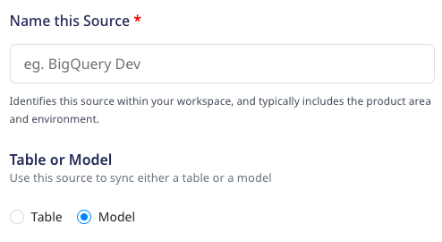
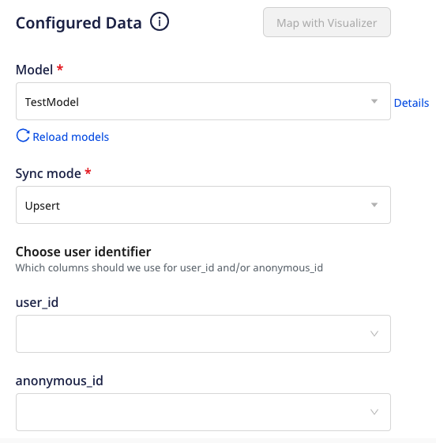

# Models

RudderStack's **Models** feature lets you define and run custom SQL queries on your warehouse data and send the results to your specified destinations. You can also define a schedule to sync the data to the destinations as required.

Some salient features of models are:
* Manage the view of all models synced to different destinations at one place.
* Reuse existing models in multiple connections.
* Build models with complex SQL queries using an intuitive UI (RudderStack dashboard).

Currently, the <strong>Models</strong> feature is supported for the following Warehouse Actions sources:
<ul>
<li><a href="https://www.rudderstack.com/docs/warehouse-actions/amazon-redshift/">Amazon Redshift</a></li> 
<li><a href="https://www.rudderstack.com/docs/warehouse-actions/google-bigquery/">Google BigQuery</a></li>
<li><a href="https://www.rudderstack.com/docs/warehouse-actions/postgresql/">PostgreSQL</a> </li>
<li><a href="https://www.rudderstack.com/docs/warehouse-actions/snowflake/">Snowflake</a></li>
</ul>

## Setting connections using models

You can create a model in the RudderStack dashboard and use it while creating a connection between a Warehouse Actions source and destination. For detailed steps on how to create a model, refer to the <a href="https://www.rudderstack.com/docs/connections/models/">Models</a> guide.

Once a model is created, you can use it to send the data from a warehouse source to a specified destination. Follow the steps listed below to achieve the same:

1. Log in to the [**RudderStack dashboard**](https://app.rudderstack.com/).
2. Select **Sources** from the left navigation bar and click on **New source**.
3. Select **Warehouse Actions** and choose any supported warehouse from the ones highlighted below: 

4. Name the source and select the **Model** option.

  
Be sure whether you want to configure the source with the <strong>Model</strong> or <strong>Table</strong> option. Once configured, this setting cannot be changed.

5. Next, set the [**Schedule Settings**](https://www.rudderstack.com/docs/warehouse-actions/common-settings/sync-schedule-settings/) to schedule the data import from your warehouse to RudderStack.

6. Once the source is set up, you can connect it to an existing or a new destination by using the **Add Destination** button.  

7. Select the required destination and configure its connection settings.

8. Next, select the required model from the dropdown list.

  
The dropdown will only display the list of models corresponding to the Warehouse Actions source you have configured. For example, only the BigQuery models will be listed in the dropdown for a BigQuery warehouse source.

9. Select the [**Sync mode**](https://www.rudderstack.com/docs/warehouse-actions/common-settings/sync-modes/) and at least one user identifier (**user_id/anonymous_id**) from the dropdown list.

You can also preview the data snippet which RudderStack will send to the destination. All the resulting columns from running the model's query are selected by default. However, you can choose to retain specific columns by searching and selecting them. You can then preview the resulting JSON on the right, as shown:

  
  Alternatively, you can map the columns using the <a href="https://www.rudderstack.com/docs/warehouse-actions/features/visual-data-mapper/">Visual Data Mapper</a> feature. For more information, refer to <a href="https://www.rudderstack.com/docs/warehouse-actions/visual-data-mapper/#choosing-the-identifier">Choosing the identifier</a> section.
  

  
The JSON payload carries the <code class="inline-code">user_id</code> and <code class="inline-code">anonymous_id</code> from the columns selected in the <strong>Choose user identifier</strong> section. Moreover, the traits are used from the columns selected in the <strong>Column</strong> section.

You can use the **Add Constant** option to add a constant key and value pair which is always sent in the JSON payload.

10. Click on **Continue** to configure the model successfully with the source and destination.

### Setting the data update schedule

You can click on the source and select the **Syncs** tab to schedule the event data sync. To know more, refer to [Sync Schedule Settings](https://www.rudderstack.com/docs/warehouse-actions/common-settings/sync-schedule-settings/).

### Updating the columns selection  

You can update the selection of columns from which RudderStack sends data to the specified destinations. Follow these steps:

1. Click on the source and select the **Schema** tab.
2. Then, click on the **Update** button, as shown:

3. Update your column selection and click on the **Save** button.

## FAQ

### What is the difference between the Table and Model options when creating a Warehouse Actions source?

When creating a new Warehouse Actions source, you are presented with the following two options from which RudderStack will sync the data:

- When you choose **Table**, RudderStack imports all the data associated with the specified table during the sync.
- When you choose **Model**, RudderStack imports the data by running the query specified in the connected model, during the sync.

## Contact us

For more information on models, you can [**contact us**](mailto:%20docs@rudderstack.com) or start a conversation in our [**Slack**](https://rudderstack.com/join-rudderstack-slack-community) community.
