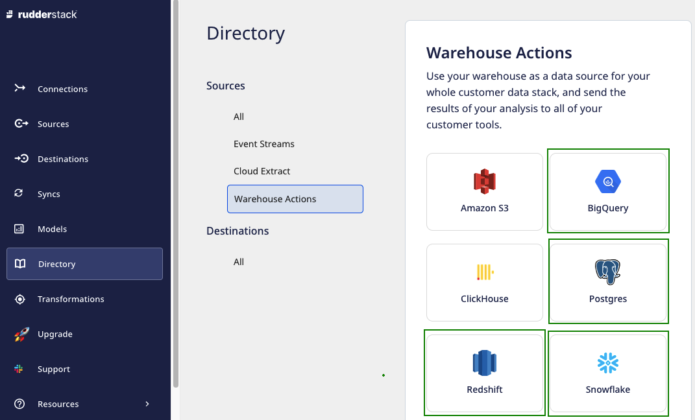

# Models

The **Models** feature provides the capability to define custom SQL queries over the warehouse and execute them to send the resultant data to the specified destinations. You can also define the **sync schedule** to sync the data to the destinations as required.

Some salient features of models are:
* Manage the view of all models synced to different destinations at one place.
* Reuse existing models in multiple connections.
* Build models with complex SQL queries using an intuitive UI (RudderStack dashboard).

Currently, the <strong>Models</strong> feature is supported for <a href="https://www.rudderstack.com/docs/warehouse-actions/amazon-redshift/">Amazon Redshift</a>, <a href="https://www.rudderstack.com/docs/warehouse-actions/google-bigquery/">Google BigQuery</a>, <a href="https://www.rudderstack.com/docs/warehouse-actions/postgresql/">PostgreSQL</a>, and <a href="https://www.rudderstack.com/docs/warehouse-actions/snowflake/">Snowflake</a> Warehouse Actions sources only.

## Setting connections using models

You can create a model in the RudderStack dashboard and use it while creating a connection between a Warehouse Actions source and destination. For detailed steps on how to create a model, refer to <a href="https://www.rudderstack.com/docs/connections/models/">Models</a>.

Once a model is created, you can use it to send the data from a warehouse source to a specified destination. Follow the steps listed below to achieve the same:

1. Log in to the **RudderStack dashboard**.
2. Select **Sources** from the left navigation bar and click on **New source**.
3. Select **Warehouse Actions** and choose any supported warehouse from the ones highlighted below: 

4. Name the source and select the **Model** option.

  
Be sure whether to configure the source with the <strong>Model</strong> or <strong>Table</strong> option. Once configured, it cannot be switched to the other one.

5. Next, set the **schedule type** and **run settings** to schedule the data import from your warehouse to RudderStack.

6. Once the source is set up, you can connect it to an existing or a new destination by using the **Add Destination** button.  

7. Select the required destination and configure its connection settings.

8. Next, select the required model from the dropdown list.

  
The dropdown will only display the list of models corresponding to the Warehouse Actions source you have configured. For example, only the BigQuery models will be listed in the dropdown for a BigQuery warehouse source.

9. Select the **Sync mode** and at least one user identifier (**user_id/anonymous_id**) from the dropdown list.

  
You can preview the data snippet which will be sent to the destination. All the resultant columns from the model's query are selected by default. However, you can choose to keep the desired columns by searching and selecting/deselecting them. The resultant JSON can be previewed on the right.

  
Alternatively, you can map the columns using the Visual Data Mapper feature. For more information, refer to <a href="https://www.rudderstack.com/docs/warehouse-actions/visual-data-mapper/#choosing-the-identifier">Choosing the identifier</a> section.
  

  
As can be observed, the JSON payload carries the <strong>user_id</strong> and <strong>anonymous_id</strong> from the columns selected in the <strong>Choose user identifier</strong> section. Further, the traits are used from the selected columns in the <strong>Column</strong> section.

You can use the **Add Constant** option to add a constant key and value pair which is always sent in the JSON payload.

10. Click on **Continue** to configure the model successfully with the source and destination.

### Setting the data update schedule

You can click on the source and select the **Syncs** tab to schedule the event data sync. To know more, refer to [Syncs]().

### Update the selection of columns  

You can update the selection of columns used to send data to the specified destinations. 

1. Click on the source and select the **Schema** tab.
2. Click on **Update** button.

3. Update your selection of columns and click on **Save** button.

## Contact us

For more information on models, you can [**contact us**](mailto:%20docs@rudderstack.com) or start a conversation in our [**Slack**](https://rudderstack.com/join-rudderstack-slack-community) community.
