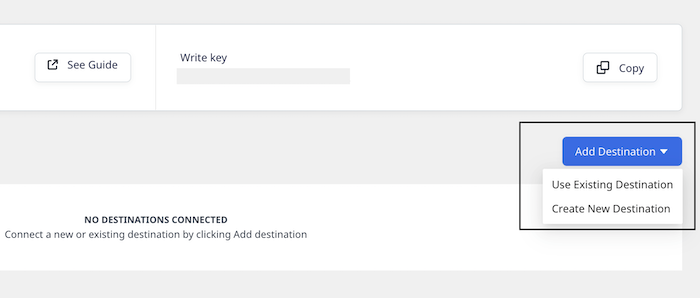

# Snowflake

[Snowflake](https://www.snowflake.com/) is a cloud-based data warehouse provided as Software-as-a-Service \(SaaS\). It offers all the features of a modern data warehouse, including scalability, ease of use, secure data access, and much more.

RudderStack supports Snowflake as a source from which you can ingest data and route it to your desired downstream destinations.

## Granting permissions

RudderStack requires you to grant certain user permissions on your Snowflake warehouse to successfully access data from it.

Run the queries listed in the following sections in the  **exact order** to grant these permissions:

<div class="warningBlock">

You must have the <strong>ACCOUNTADMIN</strong> role in order to grant these permissions.
</div>


### Step 1: Creating a new role and user in Snowflake

1. In your Snowflake console, run the following command to create a role `RUDDER_ROLE` in Snowflake. After creating the role, you can [grant object privileges](https://docs.snowflake.com/en/sql-reference/sql/grant-privilege.html) to it.

```sql
CREATE ROLE RUDDER_ROLE;
```

2. Verify if the role `RUDDER_ROLE` is successfully created.

```sql
SHOW ROLES;
```

3. Create a new user `RUDDER` with a password `<strong_unique_password>`.

```sql
CREATE USER RUDDER PASSWORD = '<strong_unique_password>' DEFAULT_ROLE = 'RUDDER_ROLE';
```

4. Verify if the user `RUDDER` is successfully created.

```sql
SHOW USERS;
```

### Step 2: Creating the RudderStack schema and granting permissions to the role

1. Create a dedicated schema `_RUDDERSTACK` in your database `<YOUR_DATABASE>`.

```sql
CREATE SCHEMA "<YOUR_DATABASE>"."_RUDDERSTACK";
```

<div class="warningBlock">

The `_RUDDERSTACK` schema is used by RudderStack for storing the state of each data sync. <strong>This name should not be changed</strong>.
</div>

2. Grant full access to the schema `_RUDDERSTACK` for the previously created role `RUDDER_ROLE` .

```sql
GRANT ALL PRIVILEGES ON SCHEMA "<YOUR_DATABASE>"."_RUDDERSTACK" TO ROLE RUDDER_ROLE;
```
**Replace `<YOUR_DATABASE>` with the exact name of your Snowflake database**.

### Step 3: Granting permissions on the warehouse, database, schema, and the table

1. Enable the user `RUDDER` to perform all the operations allowed for the role `RUDDER_ROLE`(via the privileges granted to it).

```sql
GRANT ROLE RUDDER_ROLE TO USER RUDDER;
```

2. Run the following commands to allow the role `RUDDER_ROLE` to look up the objects within your warehouse, database, schema, and the specific table or view:

```sql
GRANT USAGE ON WAREHOUSE "<YOUR_WAREHOUSE>" TO ROLE RUDDER_ROLE;
GRANT USAGE ON DATABASE "<YOUR_DATABASE>" TO ROLE RUDDER_ROLE;
GRANT USAGE ON SCHEMA "<YOUR_DATABASE>"."<YOUR_SCHEMA>" TO ROLE RUDDER_ROLE;
GRANT SELECT ON TABLE "<YOUR_DATABASE>"."<YOUR_SCHEMA>"."<YOUR_TABLE>" TO ROLE  RUDDER_ROLE;
GRANT SELECT ON VIEW "<YOUR_DATABASE>"."<YOUR_SCHEMA>"."<YOUR_VIEW>" TO ROLE  RUDDER_ROLE;
```

**Replace `<YOUR_WAREHOUSE>`, `<YOUR_DATABASE>`, `<YOUR_SCHEMA>`, `<YOUR_TABLE>`, and `<YOUR_VIEW>` with the exact names of your Snowflake warehouse, database, schema, table, and view respectively**.

#### Optional commands

<div class="warningBlock">

Run the following commands <strong>only</strong> if you're okay with RudderStack being able to access all the current or future tables/views within your specified schema.
</div>

- To allow the role `RUDDER_ROLE` to read data from **all** the tables in the schema `<YOUR_SCHEMA>`.

```sql
GRANT SELECT ON ALL TABLES IN SCHEMA "<YOUR_DATABASE>"."<YOUR_SCHEMA>" TO ROLE RUDDER_ROLE;
```

- To allow the role `<RUDDER_ROLE>` to read data from all the **future tables** in the schema `<YOUR_SCHEMA>`.

```sql
GRANT SELECT ON FUTURE TABLES IN SCHEMA "<YOUR_DATABASE>"."<YOUR_SCHEMA>" TO ROLE RUDDER_ROLE;
```

- To allow the role `RUDDER_ROLE` to read data from **all** the views in the schema `<YOUR_SCHEMA>`.

```sql
GRANT SELECT ON ALL VIEWS IN SCHEMA "<YOUR_DATABASE>"."<YOUR_SCHEMA>" TO ROLE RUDDER_ROLE;
```

- To allow the role `<RUDDER_ROLE>` to read data from all the **future views** in the schema `<YOUR_SCHEMA>`.

```sql
GRANT SELECT ON FUTURE VIEWS IN SCHEMA "<YOUR_DATABASE>"."<YOUR_SCHEMA>" TO ROLE RUDDER_ROLE;
```
**Replace `<YOUR_DATABASE>` and `<YOUR_SCHEMA>` with the exact Snowflake database and the schema names**.

## Setting up the Snowflake source in RudderStack

To set up Snowflake as a source in RudderStack, follow these steps:

### Naming the source

1. Log into your [RudderStack dashboard](https://app.rudderstack.com/).
2. From the left navigation bar, go to **Source** > **New Source** > **Warehouse Actions**.  Then, select **Snowflake**, as shown:


3. Assign a name to your source.

### Configuring the connection credentials

1. Choose the relevant option from **Table** or **Model** to use the source to sync either a table or a model.

<div class="infoBlock">

For more information on the difference between the <strong>Table</strong> and <strong>Model</strong> options when creating a Warehouse Actions source, refer to the <a href="#faq">FAQ</a> section below.
</div>

<div class="infoBlock">
If you have chosen the <strong>Model</strong> option, skip the next steps and refer to the <a href="#schedule-settings">Schedule settings</a> section directly.
</div>

2. Enter the relevant settings in the **Connection Credentials** section as listed below:

    - **Account -** This is your warehouse account ID. The account ID is part of the Snowflake URL. The following examples illustrate the slight differences in the account ID for various cloud providers:

    | Account ID sample           | Snowflake URL                                                    | Snowflake cloud provider                                        |
    | :-------------------------- | :--------------------------------------------------------------- | :-------------------------------------------------------------- |
    | **qya56091.us-east-1**      | `https://`**`qya56091.us-east-1`**`.snowflakecomputing.com`      | AWS                                     |
    | **rx18795.east-us-2.azure** | `https://`**`rx18795.east-us-2.azure`**`.snowflakecomputing.com` | Microsoft Azure |
    | **ah76025.us-central1.gcp** | `https://`**`ah76025.us-central1.gcp`**`.snowflakecomputing.com` | Google Cloud Platform                                   |

    - **Database**: Enter the name of the database in which your data resides.
    - **Warehouse**: Specify the name of your data warehouse.
    - **User**: Enter the name of the user that has the required read/write access to the above database.
    - **Password**: Enter the password for the above user.
    - **Choose your Cloud**: Specify your cloud provider in this field.

<div class="infoBlock">

If you've configured Snowflake as a source before, you can select the existing credentials under the <strong>Use existing credentials</strong> option.
</div>

3. Click on **Continue** to verify your credentials. RudderStack will then verify and validate your credentials. 

<div class="infoBlock">

For more information on these validation steps, refer to the <a href="#faq">FAQ</a> section. 
</div>

4. Once verified, click on **Continue** to proceed.

### Schedule settings

1. Specify the **Schedule Settings** to schedule the data syncs from your Snowflake instance.

<div class="infoBlock">

RudderStack lets you schedule data syncs for your Warehouse Actions sources and specify how and when the syncs will run. For more information on the <strong>Basic</strong>, <strong>CRON</strong>, and <strong>Manual</strong> schedule types, refer to the <a href="https://www.rudderstack.com/docs/warehouse-actions/common-settings/sync-schedule-settings/">Sync Schedule Settings</a> guide.
</div>

2. After specifying the schedule type and run settings, click on **Continue** to finish the setup.

Snowflake is now successfully configured as a source in your RudderStack dashboard. You can further connect this source to your preferred destination by clicking on **Add Destination** button, as shown:



<div class="infoBlock">

If you have already configured a destination in RudderStack, choose the <strong>Use Existing Destinations</strong> option which will take you to the <strong>Schema</strong> tab in the source settings. To add a new destination from scratch, select the <strong>Create New Destination</strong> option which will take you to the destination configuration page.
</div>

## Specifying the data to import

While connecting a destination to your Warehouse Actions source, you can use the default JSON mapping or the [Visual Data Mapping](https://www.rudderstack.com/docs/warehouse-actions/features/visual-data-mapper/) feature.

<div class="infoBlock">

Based on the option(Table/Model) you chose while setting up the Warehouse Actions source, follow the relevant guide for detailed steps:

<ul>
<li><a href="https://www.rudderstack.com/docs/warehouse-actions/common-settings/importing-data-using-tables/">Importing Data using Tables</a></li>
<li><a href="https://www.rudderstack.com/docs/warehouse-actions/common-settings/importing-data-using-models/">Importing Data using Models</a></li>
</ul>
</div>

## FAQ

### What is the difference between the Table and Model options when creating a Warehouse Actions source?

When creating a new Warehouse Actions source, you are presented with the following two options from which RudderStack will sync the data:


- When you choose **Table**, RudderStack imports all the data associated with the specified table during the sync.
- When you choose **Model**, RudderStack imports the data by running the query specified in the connected model, during the sync.

### What do the three validations under Verifying Credentials imply?

When setting up a Warehouse Actions source, once you proceed after entering the connection credentials, you will see the following three validations under the **Verifying Credentials** option:


These options are explained below:

* **Verifying Connection**: This option indicates that RudderStack is trying to connect to the warehouse with the information specified in the connection credentials. 

<div class="warningBlock">

If this option gives an error, it means that one or more fields specified in the connection credentials are incorrect. Verify your credentials in this case.
</div>

* **Able to List Schema**: This option checks if RudderStack is able to fetch all the schema details using the provided credentials. 
* **Able to Access RudderStack Schema**: This option implies that RudderStack is able to access the `_RUDDERSTACK` schema you have created by successfully running all the commands in the [**User Permissions**](https://rudderstack.com/docs/warehouse-actions/snowflake#granting-permissions) section. 

<div class="warningBlock">

If this option gives an error, verify if you have successfully created the <code class="inline-code">_RUDDERSTACK</code> schema and given RudderStack the required permissions to access it. For more information, refer to the <a href="#step-2-creating-the-rudderstack-schema-and-granting-permissions-to-the-role">Creating the RudderStack schema and granting permissions</a> section.
</div>

If you are trying to reuse the credentials for your Warehouse Actions sources set up before September 2021, you may run into the following permissions error:


As mentioned above, you will need to update your Snowflake account permissions by following the commands in [Creating the RudderStack schema and granting permissions to the role](#step-2-creating-the-rudderstack-schema-and-granting-permissions-to-the-role) section.

## Contact us

For queries on any of the sections covered in this guide, you can [**contact us**](mailto:%20docs@rudderstack.com) or start a conversation in our [**Slack**](https://rudderstack.com/join-rudderstack-slack-community) community.
