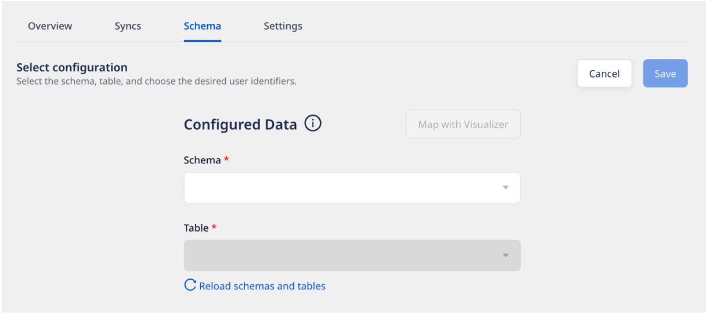

# Snowflake

[Snowflake](https://www.snowflake.com/) is a cloud-based data warehouse provided as Software-as-a-Service \(SaaS\). It offers all the features of a modern data warehouse, including scalability, ease of use, secure data access, and much more.

RudderStack supports Snowflake as a source from which you can ingest enriched user information and route it to your desired downstream destinations.

## Granting permissions

Run the SQL queries listed in the following sections in the  **exact order** to grant the necessary user permissions for the Snowflake source:

<div class="warningBlock">

You must have the <strong>ACCOUNTADMIN</strong> role in order to grant these permissions.
</div>


### Step 1: Creating a new role and user in Snowflake

1. In your Snowflake console, run the following command to create a role `RUDDER_ROLE` in Snowflake. After creating the role, you can grant object privileges to it.

```sql
CREATE ROLE RUDDER_ROLE;
```

2. To verify if the role `RUDDER_ROLE` is successfully created, run the following command:

```sql
SHOW ROLES;
```

3. Then, create a new user `RUDDER` with a strong password `<strong_unique_password>`, as shown:

```sql
CREATE USER RUDDER PASSWORD = '<strong_unique_password>' DEFAULT_ROLE = 'RUDDER_ROLE';
```

4. To verify if the user `RUDDER` is successfully created, run the following command:

```sql
SHOW USERS;
```

### Step 2: Creating the RudderStack schema and granting permissions to the role

1. Create a dedicated schema `_RUDDERSTACK` in your database `<YOUR_DATABASE_NAME>`.

```sql
CREATE SCHEMA "<YOUR_DATABASE_NAME>"."_RUDDERSTACK";
```

<div class="warningBlock">

The `_RUDDERSTACK` schema is used by RudderStack for storing the state of each data sync. <strong>This name should not be changed</strong>.
</div>

2. To allow the previously created role `RUDDER_ROLE` to have full access to the schema `_RUDDERSTACK`, run the following command:

```sql
GRANT ALL PRIVILEGES ON SCHEMA "<YOUR_DATABASE>"."_RUDDERSTACK" TO ROLE RUDDER_ROLE;
```

### Step 3: Granting permissions on the warehouse, database, schema, and the table

1. Enable the user `RUDDER` to perform all the operations allowed for the role `RUDDER_ROLE`(via the access privileges granted to it), as shown:

```sql
GRANT ROLE RUDDER_ROLE TO USER RUDDER;
```

2. Allow the role `RUDDER_ROLE` to look up the objects within the warehouse `<YOUR_WAREHOUSE>` by running the following command. **Remember to replace `<YOUR_WAREHOUSE>` with the exact name of your Snowflake data warehouse**.

```sql
GRANT USAGE ON WAREHOUSE "<YOUR_WAREHOUSE>" TO ROLE RUDDER_ROLE;
```

3. Next, allow the role `RUDDER_ROLE` to look up objects within the database `<YOUR_DATABASE>`. **Remember to replace `<YOUR_DATABASE>` with the exact name of your Snowflake database**.

```sql
GRANT USAGE ON DATABASE "<YOUR_DATABASE>" TO ROLE RUDDER_ROLE;
```

4. To allow the role `RUDDER_ROLE` look up objects within the schema `<YOUR_SCHEMA>`, run the following command. **Remember to replace `<YOUR_DATABASE>` and `<YOUR_SCHEMA>` with the exact Snowflake database and the schema names**.

```sql
GRANT USAGE ON SCHEMA "<YOUR_DATABASE>"."<YOUR_SCHEMA>" TO ROLE RUDDER_ROLE;
```

5. Allow the role `RUDDER_ROLE` to read the data from the specified table `<YOUR_TABLE>`, as shown below. **Remember to replace `<YOUR_DATABASE>`, `<YOUR_SCHEMA>`, and `<YOUR_TABLE>` with the exact Snowflake database, schema, and table names**.

```sql
GRANT SELECT ON TABLE "<YOUR_DATABASE>"."<YOUR_SCHEMA>"."<YOUR_TABLE>" TO ROLE  RUDDER_ROLE;
```

6. The following command allows the role `RUDDER_ROLE` to read the data from the specified view `<YOUR_VIEW>`. **Remember to replace `<YOUR_DATABASE>`, `<YOUR_SCHEMA>`, and `<YOUR_VIEW>` with the exact database, schema, and view names in Snowflake**.

```sql
GRANT SELECT ON VIEW "<YOUR_DATABASE>"."<YOUR_SCHEMA>"."<YOUR_VIEW>" TO ROLE  RUDDER_ROLE;
```

#### Optional commands

- Run the following command to allow the role `RUDDER_ROLE` to read data from **all** the tables in the schema `<YOUR_SCHEMA>`. **Remember to replace `<YOUR_DATABASE>` and `<YOUR_SCHEMA>` with the exact Snowflake database and the schema names**.

```sql
GRANT SELECT ON ALL TABLES IN SCHEMA "<YOUR_DATABASE>"."<YOUR_SCHEMA>" TO ROLE RUDDER_ROLE;
```

<div class="warningBlock">

Run the above command only if you're okay with RudderStack being able to access all the tables within your specified schema. 
</div>

- To allow the role `<RUDDER_ROLE>` to read data from all the **future tables** in the schema `<YOUR_SCHEMA>`, run the following command. **Remember to replace `<YOUR_DATABASE>` and `<YOUR_SCHEMA>` with the exact Snowflake database and the schema names**.

```sql
GRANT SELECT ON FUTURE TABLES IN SCHEMA "<YOUR_DATABASE>"."<YOUR_SCHEMA>" TO ROLE RUDDER_ROLE;
```

<div class="warningBlock">

Run the above command only if you're okay with RudderStack being able to access the data in all the future tables residing within your specified schema.
</div>

- The following command allows the role `RUDDER_ROLE` to read data from **all** the views in the schema `<YOUR_SCHEMA>`:

```sql
GRANT SELECT ON ALL TABLES IN SCHEMA "<YOUR_DATABASE>"."<YOUR_SCHEMA>" TO ROLE RUDDER_ROLE;
```

<div class="warningBlock">

Run the above command only if you're okay with RudderStack being able to access all the views within your specified schema.
</div>

- To allow the role `<RUDDER_ROLE>` to read data from all the **future views** in the schema `<YOUR_SCHEMA>`, run the following command:

```sql
GRANT SELECT ON FUTURE VIEWS IN SCHEMA "<YOUR_DATABASE>"."<YOUR_SCHEMA>" TO ROLE RUDDER_ROLE;
```

<div class="warningBlock">

Run the above command only if you're okay with RudderStack being able to access all the future views residing within your specified schema.
</div>

## Setting up the source

To set up Snowflake as a source in RudderStack, follow these steps:

1. Log into your [RudderStack dashboard](https://app.rudderstack.com/).
2. From the left navigation bar, select **Directory** > **Warehouse Actions**.  Then, select **Snowflake**, as shown:


3. Assign a name to your source.
4. Choose the relevant option from **Table** or **Model** to use the source to sync either a table or a model.

<div class="infoBlock">

For more information on the difference between the <strong>Table</strong> and <strong>Model</strong> options when creating a Warehouse Actions source, refer to the <a href="#faq">FAQ</a> section below.
</div>

<div class="infoBlock">

The subsequent steps in this section focus on setting up a Warehouse Actions source by leveraging your <strong>warehouse table</strong>. For steps on setting up the source using a model, refer to the <a href="https://www.rudderstack.com/docs/warehouse-actions/features/setting-up-connections-using-models/">Setting up Connections Using Models</a> guide.
</div>

5. Next, enter the relevant connection details in the **Connection Credentials** as shown below. The required settings are listed below:

    - **Account -** This is your warehouse account ID. The account ID is part of the Snowflake URL. The following examples illustrate the slight differences in the account ID for various cloud providers:

    | Account ID sample           | Snowflake URL                                                    | Snowflake cloud provider                                        |
    | :-------------------------- | :--------------------------------------------------------------- | :-------------------------------------------------------------- |
    | **qya56091.us-east-1**      | `https://`**`qya56091.us-east-1`**`.snowflakecomputing.com`      | AWS                                     |
    | **rx18795.east-us-2.azure** | `https://`**`rx18795.east-us-2.azure`**`.snowflakecomputing.com` | Microsoft Azure |
    | **ah76025.us-central1.gcp** | `https://`**`ah76025.us-central1.gcp`**`.snowflakecomputing.com` | Google Cloud Platform                                   |

    - **Database**: Enter the name of the database in which your data resides.
    - **Warehouse**: Specify the name of your data warehouse.
    - **User**: Enter the name of the user that has the required read/write access to the above database.
    - **Password**: Enter the password for the above user.
    - **Choose your Cloud**: Specify your cloud provider in this field.

### Schedule settings

RudderStack lets you schedule data syncs for your Warehouse Actions sources and specify how and when the syncs will run.

<div class="infoBlock">

For for information on the Basic, CRON, and Manual schedule types, refer to the <a href="https://www.rudderstack.com/docs/warehouse-actions/common-settings/sync-schedule-settings/">Sync Schedule Settings</a> guide.
</div>

That's it! Snowflake is now successfully configured as a source on your RudderStack dashboard. You can further connect this source to your preferred destination by clicking on **Add Destinations** button, as shown:


<div class="infoBlock">

If you have already configured a destination in RudderStack, choose the <strong>Use Existing Destinations</strong> option. To add a new destination from scratch, select the <strong>Create New Destination</strong> option.
</div>

## Specifying the data to import

Once you connect a destination to your Warehouse Actions source, you will automatically be redirected to the **Schema** tab within the source settings, as shown:



<div class="infoBlock">

Refer to the <a href="https://www.rudderstack.com/docs/warehouse-actions/common-settings/sync-configuration-settings/">Sync Configuration Settings</a> guide for the various settings that specify the warehouse data you want RudderStack to sync to the destination.
</div>

## FAQ

### What do the three validations under Verifying Credentials imply?

When setting up a Warehouse Actions source, once you proceed after entering the connection credentials, you will see the following three validations under the **Verifying Credentials** option:


These options are explained below:

* **Verifying Connection**: This option indicates that RudderStack is trying to connect to the warehouse with the information specified in the connection credentials. 

<div class="warningBlock">

If this option gives an error, it means that one or more fields specified in the connection credentials are incorrect. Verify your credentials in this case.
</div>

* **Able to List Schema**: This option checks if RudderStack is able to fetch all the schema details using the provided credentials. 
* **Able to Access RudderStack Schema**: This option implies that RudderStack is able to access the `_RUDDERSTACK` schema you have created by successfully running all the commands in the [**User Permissions**](https://rudderstack.com/docs/warehouse-actions/snowflake#granting-permissions) section. 

<div class="warningBlock">

If this option gives an error, verify if you have successfully created the <code class="inline-code">_RUDDERSTACK</code> schema and given RudderStack the required permissions to access it. For more information, refer to [this section](https://rudderstack.com/docs/warehouse-actions/snowflake#creating-the-rudderstack-schema-and-granting-permissions).
</div>

<div class="infoBlock">

If you are trying to reuse the credentials for Warehouse Actions sources from before September 2021, you may run into the following permissions error:


As mentioned above, you will need to update your Snowflake account permissions by following the commands in [this section](https://rudderstack.com/docs/warehouse-actions/snowflake#creating-the-rudderstack-schema-and-granting-permissions).
</div>

### What is the difference between the Table and Model options when creating a Warehouse Actions source?

When creating a new Warehouse Actions source, you are presented with the following two options from which RudderStack will sync the data:


- When you choose **Table**, RudderStack imports all the data associated with the specified table during the sync.
- When you choose **Model**, RudderStack imports the data by running the query specified in the connected model, during the sync.

## Contact us

For queries on any of the sections covered in this guide, you can [**contact us**](mailto:%20docs@rudderstack.com) or start a conversation in our [**Slack**](https://rudderstack.com/join-rudderstack-slack-community) community.
