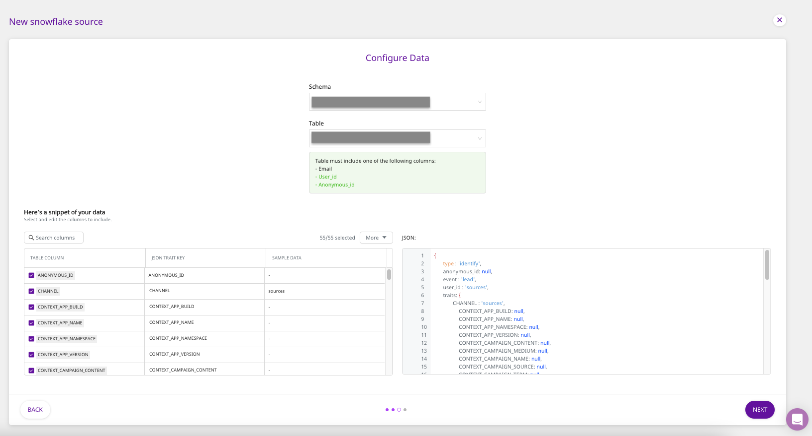
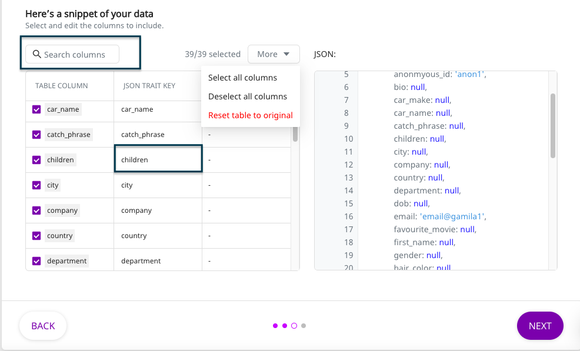

# Snowflake

[Snowflake](https://www.snowflake.com/) is a cloud-based data warehouse provided as Software-as-a-Service \(SaaS\). It offers all the features of a modern data warehouse, including scalability, ease of use, secure access to your data, accelerated analytics capabilities, and much more.

This guide will help you configure Snowflake as a source from which you can route event data to your desired destinations through RudderStack.

## Granting Permissions

<div class="warningBlock">

You must have the **ACCOUNTADMIN** role in order to grant the necessary permissions.
</div>


Run the following SQL queries in the **exact order** to grant the necessary permissions for the Snowflake Warehouse Actions source:

### User & role creation

* The following command creates the role `RUDDER_ROLE` in Snowflake. After creating the role, you can grant object privileges to it.

```
CREATE ROLE RUDDER_ROLE;
```

* The following command verifies if the role `RUDDER_ROLE` is successfully created.

```
SHOW ROLES;
```

* The following command creates a new user `RUDDER` with your password `<strong_unique_password>` in Snowflake.

```
CREATE USER RUDDER PASSWORD = '<strong_unique_password>' DEFAULT_ROLE = 'RUDDER_ROLE';
```

* The following command verifies if the user `RUDDER` is successfully created.

```
SHOW USERS;
```

### Creating the RudderStack schema & granting permissions

* The following command creates a dedicated schema `_RUDDERSTACK` to be used by RudderStack for storing the state of each data sync.

```
CREATE SCHEMA "<YOUR_DATABASE>"."_RUDDERSTACK";
```

<div class="warningBlock">

The `_RUDDERSTACK` schema is used by RudderStack. Its name **should not** be changed.
</div>

* The following command allows `RUDDER_ROLE` to have full access to the schema `_RUDDERSTACK`.

```
GRANT ALL PRIVILEGES ON SCHEMA "<YOUR_DATABASE>"."_RUDDERSTACK" TO ROLE RUDDER_ROLE;
```

### Granting permissions on the warehouse, database, schema & the table

* The following command enables the user \(`RUDDER`\) to perform all the operations allowed for the role `RUDDER_ROLE` \(via the access privileges granted to it\).

```
GRANT ROLE RUDDER_ROLE TO USER RUDDER;
```

* The following command allows the role `RUDDER_ROLE` to look up the objects within the warehouse `<YOUR_WAREHOUSE>`. Replace `<YOUR_WAREHOUSE>` with the exact name of your data warehouse in Snowflake.

```
GRANT USAGE ON WAREHOUSE "<YOUR_WAREHOUSE>" TO ROLE RUDDER_ROLE;
```

* The following command allows the role `RUDDER_ROLE` to look up objects within the database `<YOUR_DATABASE>`. Replace `<YOUR_DATABASE>` with the exact name of your database in Snowflake.

```
GRANT USAGE ON DATABASE "<YOUR_DATABASE>" TO ROLE RUDDER_ROLE;
```

* The following command lets the role `RUDDER_ROLE` look up objects within the schema `<YOUR_SCHEMA>`. Replace `<YOUR_DATABASE>` and `<YOUR_SCHEMA>` with the exact name of your database and the schema in Snowflake.

```
GRANT USAGE ON SCHEMA "<YOUR_DATABASE>"."<YOUR_SCHEMA>" TO ROLE RUDDER_ROLE;
```

* The following command allows the role `RUDDER_ROLE` to read the data from the specified table `<YOUR_TABLE>`. Replace `<YOUR_DATABASE>`, `<YOUR_SCHEMA>`, and `<YOUR_TABLE>` with the exact database, schema, and table names in Snowflake.

```
GRANT SELECT ON TABLE "<YOUR_DATABASE>"."<YOUR_SCHEMA>"."<YOUR_TABLE>" TO ROLE  RUDDER_ROLE;
```

* The following **optional** command allows the role `RUDDER_ROLE` to read data from **all** the tables in the schema `<YOUR_SCHEMA>`:

```
GRANT SELECT ON ALL TABLES IN SCHEMA "<YOUR_DATABASE>"."<YOUR_SCHEMA>" TO ROLE RUDDER_ROLE;
```

<div class="warningBlock">

Run the above command only if you're okay with RudderStack being able to access all the tables within your specified schema.
</div>

* The following **optional** command allows the role `<RUDDER_ROLE>` to read data from all the **future** **tables** in the schema `<YOUR_SCHEMA>`:

```
GRANT SELECT ON FUTURE TABLES IN SCHEMA "<YOUR_DATABASE>"."<YOUR_SCHEMA>" TO ROLE RUDDER_ROLE;
```
<div class="warningBlock">

Run the above command only if you're okay with RudderStack being able to access the data in all the future tables residing within your specified schema.
</div>

* The following command allows the role `RUDDER_ROLE` to read the data from the specified view `<YOUR_VIEW>`. Replace `<YOUR_DATABASE>`, `<YOUR_SCHEMA>`, and `<YOUR_VIEW>` with the exact database, schema, and view names in Snowflake.

```
GRANT SELECT ON VIEW "<YOUR_DATABASE>"."<YOUR_SCHEMA>"."<YOUR_VIEW>" TO ROLE  RUDDER_ROLE;
```

* The following **optional** command allows the role `RUDDER_ROLE` to read data from **all** the views in the schema `<YOUR_SCHEMA>`:

```
GRANT SELECT ON ALL TABLES IN SCHEMA "<YOUR_DATABASE>"."<YOUR_SCHEMA>" TO ROLE RUDDER_ROLE;
```

<div class="warningBlock">

Run the above command only if you're okay with RudderStack being able to access all the views within your specified schema.
</div>

* The following **optional** command allows the role `<RUDDER_ROLE>` to read data from all the **future views** in the schema `<YOUR_SCHEMA>`:

```
GRANT SELECT ON FUTURE VIEWS IN SCHEMA "<YOUR_DATABASE>"."<YOUR_SCHEMA>" TO ROLE RUDDER_ROLE;
```

<div class="warningBlock">

Run the above command only if you're okay with RudderStack being able to access all the future views residing within your specified schema.
</div>

## Setting Up the Source

To set up Snowflake as a source in RudderStack, follow these steps:

* Log into your [**RudderStack dashboard**](https://app.rudderlabs.com/signup?type=freetrial).
* From the left panel, select **Sources**. Then, click on **Add Source**, as shown:


- Scroll down to the **Warehouse Sources** and select **Snowflake**. Then, click on **Next**.


### Setting Up the Connection

- Assign a name to your source, and click on **Create Credentials from Scratch**. Then, click on **Next**.

<div class="successBlock">

  If you've already configured Snowflake as a source before, your existing
  credentials will automatically appear under
  **Use existing credentials**.
</div>

- Next, enter the relevant connection details in the **Connection Credentials** as shown below:


- The required settings are:

  - **Account -** This is the account ID of your warehouse. The account ID is part of the Snowflake URL. The following examples illustrate the slight differences in the account ID for various cloud providers**.**

    | Account ID sample           | Snowflake URL                                                    | Snowflake cloud provider                                        |
    | :-------------------------- | :--------------------------------------------------------------- | :-------------------------------------------------------------- |
    | **qya56091.us-east-1**      | `https://`**`qya56091.us-east-1`**`.snowflakecomputing.com`      | Amazon Web Services \(AWS\)                                     |
    | **rx18795.east-us-2.azure** | `https://`**`rx18795.east-us-2.azure`**`.snowflakecomputing.com` | Microsoft Azure \(Azure[\)](https://azure.microsoft.com/en-us/) |
    | **ah76025.us-central1.gcp** | `https://`**`ah76025.us-central1.gcp`**`.snowflakecomputing.com` | Google Cloud Platform \(GCP\)                                   |

  - **Database -** The name of the database in which your data resides goes here.
  - **Warehouse** - Specify the name of the warehouse here.
  - **User** - The username which has the required read/write access to the above database.
  - **Password** - The password for the above user should be specified here.
  - **Your Cloud** - Please specify the cloud service in this field.

### Specifying the Data to Import

- Next, select the **Schema** and the **Table** from which you want RudderStack to import the data.



<div class="warningBlock">

Your table must include one of the following columns - <code class="inline-code">email</code>, <code class="inline-code">user_id</code>, or <code class="inline-code">anonymous_id</code>.

</div>

- Once you specify the table containing the required columns, you will be able to preview a snippet of your data, as shown below:


- Here, you can select all or only a few specific columns of your choice, search the columns by a keyword, and also edit the **JSON Trait Key**, as shown below. You can also preview the resultant JSON on the right. Once you've select the required table columns to import the data from, click on **Next**.



### Setting the Data Update Schedule

- Next, you will be required to set the **Run Frequency** to schedule the data import from your Snowflake instance to RudderStack. You can also specify the time when you want this synchronization to start, by choosing the time under the **Sync Starting At** option. Then, click on **Next**.


That's it! Snowflake is now successfully configured as a source on your RudderStack dashboard.

RudderStack will start importing data from your Snowflake instance as per the specified frequency. You can further connect this source to your preferred destination by clicking on **Connect Destinations** or **Add Destinations**, as shown:


<div class="infoBlock">

If you have already configured a destination on the RudderStack platform, choose the **Connect Destinations** option. To add a new destination from scratch, you can select the **Add Destination** option.

</div>

## FAQ

### What do the three validations under Verifying Credentials imply?

When setting up a Warehouse Actions source, once you proceed after entering the connection credentials, you will see the following three validations under the **Verifying Credentials** option:


These options are explained below:

* **Verifying Connection**: This option indicates that RudderStack is trying to connect to the warehouse with the information specified in the connection credentials. 

<div class="warningBlock">

If this option gives an error, it means that one or more fields specified in the connection credentials are incorrect. Verify your credentials in this case.
</div>

* **Able to List Schema**: This option checks if RudderStack is able to fetch all the schema details using the provided credentials. 
* **Able to Access RudderStack Schema**: This option implies that RudderStack is able to access the `_RUDDERSTACK` schema you have created by successfully running all the commands in the [**User Permissions**](https://rudderstack.com/docs/warehouse-actions/snowflake#granting-permissions) section. 

<div class="warningBlock">

If this option gives an error, verify if you have successfully created the `_RUDDERSTACK` schema and given RudderStack the required permissions to access it. For more information, refer to [**this section**](https://rudderstack.com/docs/warehouse-actions/snowflake#creating-the-rudderstack-schema-and-granting-permissions).
</div>

<div class="infoBlock">

**If you are trying to re-use the credentials for Warehouse Actions from before September 2021, you may run into the following permissions error:**


As mentioned above, you will need to update your Snowflake account permissions by following the commands in [**this section**](https://rudderstack.com/docs/warehouse-actions/snowflake#creating-the-rudderstack-schema-and-granting-permissions).

</div>

## Contact Us

If you come across any issues while configuring Snowflake as a source on the RudderStack dashboard, please feel free to [contact us](mailto:%20docs@rudderstack.com). You can also start a conversation on our [Slack](https://rudderstack.com/join-rudderstack-slack-community) channel; we will be happy to talk to you!
