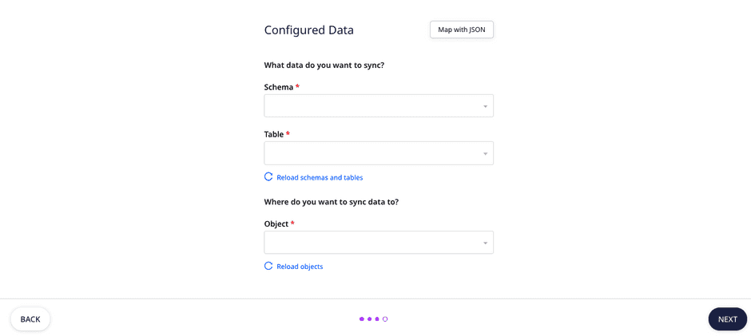
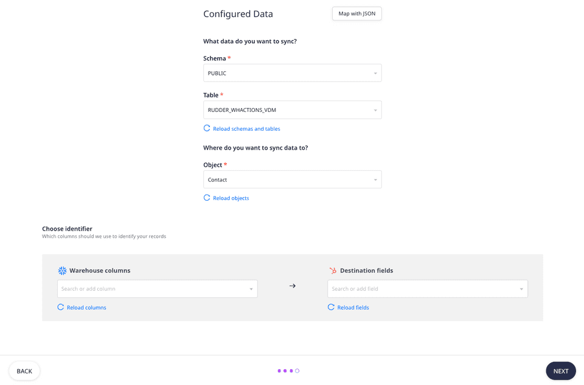
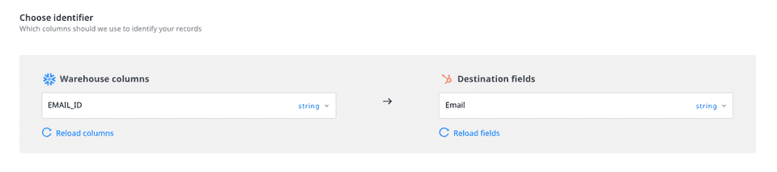
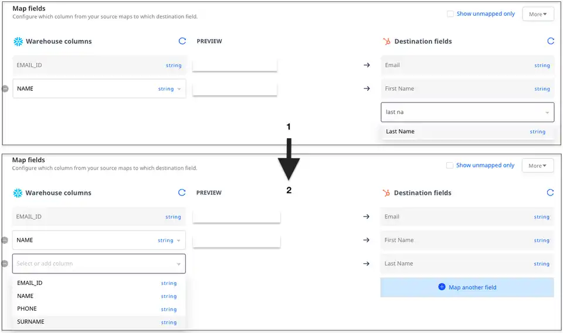
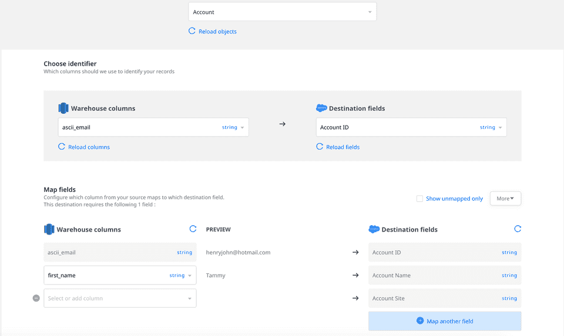
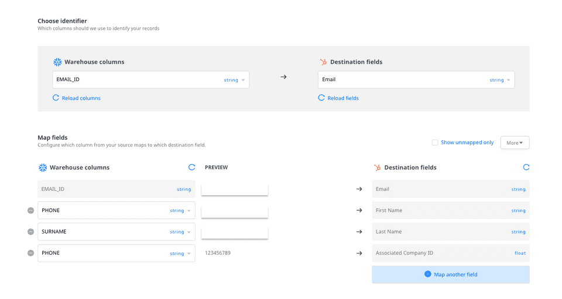
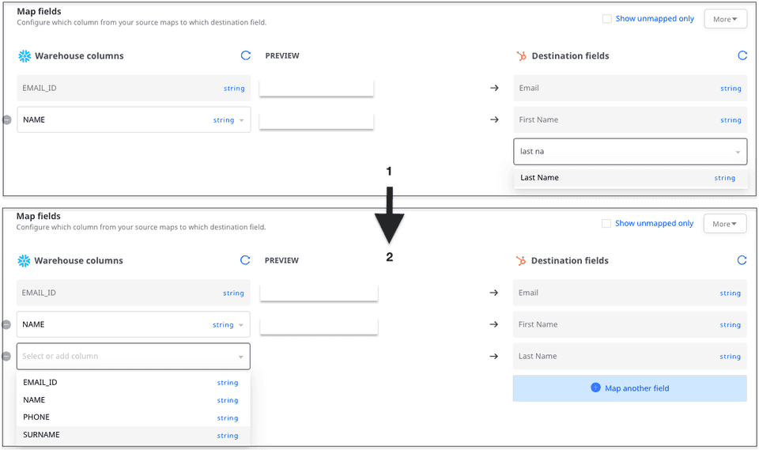

# Visual Data Mapper

The **Visual Data Mapper** \(VDM\) offers an intuitive UI to easily map your warehouse columns to specific destination fields. This is useful especially when mapping your warehouse data to custom fields defined in your destination without any second-guessing.

  This feature is currently available for the following destinations:
 <ul>
  <li><a href="https://rudderstack.com/docs/destinations/marketing/customer.io/">Customer.io</a></li>
  <li><a href="https://rudderstack.com/docs/destinations/crm/hubspot/">HubSpot</a></li>
  <li><a href="https://rudderstack.com/docs/destinations/crm/salesforce/">Salesforce</a></li>
  <li><a href="https://rudderstack.com/docs/destinations/marketing/mailchimp/">Mailchimp</a></li>
  <li><a href="https://rudderstack.com/docs/destinations/marketing/iterable/">Iterable</a></li>
  <li><a href="https://rudderstack.com/docs/destinations/marketing/braze/">Braze</a></li>
  <li><a href="https://rudderstack.com/docs/destinations/business-messaging/intercom/">Intercom</a></li>
  <li><a href="https://rudderstack.com/docs/destinations/marketing/klaviyo/">Klaviyo</a></li>
 </ul>

To use this feature, you can use an existing <a href="https://rudderstack.com/docs/warehouse-actions/">warehouse source</a> and then connect it to a VDM-supported destination.

You can connect only one destination to a Warehouse Actions source. If you want to send data from a warehouse source to multiple destinations, we recommend creating a new warehouse source with the same settings for each destination.

## Using the Visual Data Mapper

To use the Visual Data Mapper, follow these steps:

- Set up a [**Warehouse Actions**](https://rudderstack.com/docs/warehouse-actions/) source. Then, connect it to a destination.

Follow our guide on <a href="https://rudderstack.com/docs/connections/adding-source-and-destination-rudderstack/">Adding a Source and Destination in RudderStack</a> for more information.

As mentioned above, RudderStack currently supports the visual data mapping feature for [**Customer.io**](https://rudderstack.com/docs/destinations/marketing/customer.io/), [**HubSpot**](https://rudderstack.com/docs/destinations/crm/hubspot/), [**Salesforce**](https://rudderstack.com/docs/destinations/crm/salesforce/), [**Mailchimp**](https://rudderstack.com/docs/destinations/marketing/mailchimp/), [**Iterable**](https://rudderstack.com/docs/destinations/marketing/iterable/), [**Braze**](https://rudderstack.com/docs/destinations/marketing/braze/), [**Intercom**](https://rudderstack.com/docs/destinations/business-messaging/intercom/), and [**Klaviyo**](https://rudderstack.com/docs/destinations/marketing/klaviyo/). 

- Configure the required destination with the relevant settings and click on **Next**. You should then see the following screen:
  

The Visual Data Mapper option is enabled for the supported destinations by default. 

Clicking on **Map with JSON** will cause the Visual Data Mapper to be disabled. You can then configure the data via JSON.

* Choose the source warehouse **Schema** and **Table** from where you want to sync the data.

RudderStack automatically loads all the relevant warehouse schemas and tables. If you have added a new schema or table during this configuration process, click on <strong>Reload schemas and tables</strong> to get all the latest schemas and tables.

* Also, select the destination **Object** where you want to sync the data. An example in case of the [**HubSpot**](https://rudderstack.com/docs/destinations/crm/hubspot/) destination is as shown:

RudderStack automatically loads all the relevant destination objects. If you have added a new destination object during this configuration process, click on <strong>Reload objects</strong> to get all the latest objects.

<strong>RudderStack does not support objects that do not have any fields or a unique user identifier.</strong>

### Choosing the identifier

In the **Choose Identifier** section, specify the warehouse column to be used as the primary user identifier \(`user_id`\) and mapped to the destination field. An example is shown below:

### Mapping the fields

In the **Map Fields** section, you can easily configure the source-destination field mappings. Follow these steps:

* Click on the **Map another field** option. From the dropdown, select the **Destination field**. Then, select the **Warehouse column** to want to map to this field.

RudderStack gives you full visibility into the name and type of the fields that you are mapping. 

#### Mandatory mappings

When sending events to some objects, there are some required fields that need to be mapped. These fields cannot be removed from the mappings. For example, in case of the Salesforce **Account** object, **Account Name** is a required field, as seen in the following image:

#### Mapping fields of different type/format

In case you are mapping fields that are of a different type or format, you can use the [**Transformations**](https://rudderstack.com/docs/transformations/) feature to ensure there is no type mismatch while sending the events. 

For example, RudderStack lets you map the warehouse column `Phone` of type `string` to a destination field `Company ID` of type `float` . You can then add a transformation at the destination end to do this type conversion to ensure there is no mismatch.

### Creating a custom destination field

 This feature is currently available only for the <a href="https://rudderstack.com/docs/destinations/marketing/braze/">Braze</a> destination.

RudderStack also lets you create a custom destination field and map it to a warehouse column. You can do this by following the steps below:

* Click on the **Map another field** option. 
* Type the name of the custom destination field that you want to create, as shown:

* Finally, click on **Create `<custom_field_name>`**.

Once you have mapped all the source columns to the destination fields, click on **Next** to complete the destination configuration.

## Contact us

For any questions or issues on the Visual Data Mapper feature, you can [**contact us**](mailto:%20docs@rudderstack.com) or start a conversation on our [**Slack**](https://rudderstack.com/join-rudderstack-slack-community) channel.
